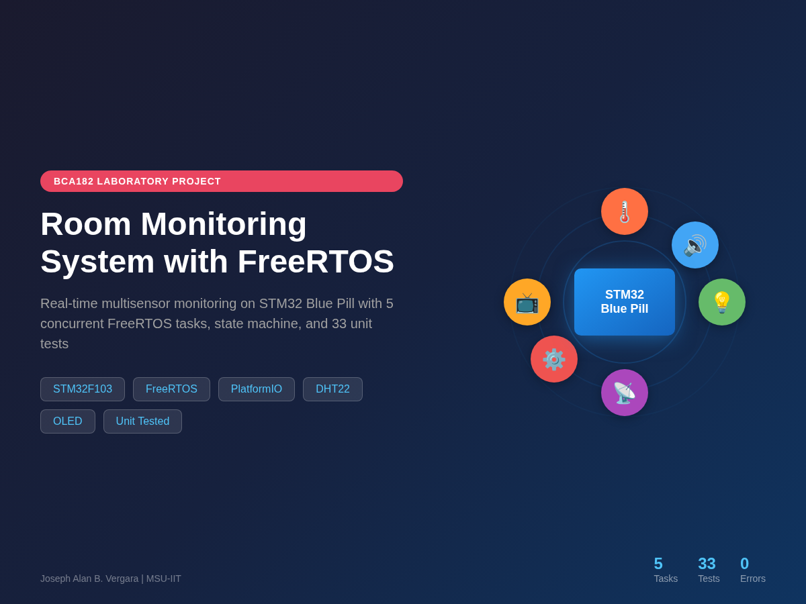

# BCA182 Real-Time Multisensor Room Monitoring System



## Project Overview

A real-time environmental monitoring system built on the **STM32 Blue Pill** using **FreeRTOS** and **PlatformIO**. The system monitors temperature, humidity, ambient light, and motion, displaying data on an SSD1306 OLED display with rotary encoder navigation. It features a power-saving state machine that blanks the display when no motion is detected.

**Repository:** [github.com/Joal0816/BCA182-RoomMonitor](https://github.com/Joal0816/BCA182-RoomMonitor)

---

## Features

- **Multi-sensor monitoring**: DHT22 (temperature/humidity), LDR (light), PIR (motion)
- **OLED display**: 4-page display with rotary encoder navigation
- **Temperature alarm**: Configurable buzzer alerts for out-of-range temperatures
- **Power management**: Automatic INACTIVE state after 15s of no motion
- **FreeRTOS architecture**: 5 concurrent tasks with proper priorities and synchronization
- **Modular design**: Separated HAL drivers, logic, and task implementations
- **Unit tested**: 33 automated tests for hardware-independent logic

---

## Learning Outcomes

This laboratory demonstrates:
- STM32 project creation with PlatformIO and STM32Cube framework
- Wokwi circuit simulation
- Sensor/actuator interfacing (DHT22, LDR, PIR, OLED, Encoder, Buzzer)
- FreeRTOS task management, priorities, and scheduling
- Inter-task communication (queues, event groups, mutexes)
- Periodic execution with `vTaskDelayUntil()`
- Embedded state machine implementation
- Hardware-independent unit testing
- Static code analysis
- Professional Git workflow and documentation

---

## System Architecture

```
                    ┌─────────────────────────────┐
                    │      STM32 Blue Pill         │
                    │       (FreeRTOS)             │
                    └──────────┬──────────────────┘
                               │
        ┌──────────────────────┼──────────────────────┐
        │                      │                      │
        ▼                      ▼                      ▼
  ┌──────────┐          ┌──────────┐          ┌──────────┐
  │SensorTask│          │InputTask │          │MotionTask│
  │  (Prio 2)│          │ (Prio 3) │          │ (Prio 3) │
  └────┬─────┘          └────┬─────┘          └────┬─────┘
       │                     │                     │
  ┌────▼─────┐          ┌────▼─────┐          ┌────▼─────┐
  │ DHT22    │          │ Encoder  │          │   PIR    │
  │ LDR      │          │          │          │          │
  └────┬─────┘          └────┬─────┘          └────┬─────┘
       │                     │                     │
       │              ┌──────▼──────┐              │
       │              │ Event Group │◄─────────────┘
       │              └──────┬──────┘
       │                     │
  ┌────▼─────────────────────▼────┐
  │         sensor_queue          │
  └────┬─────────────────────┬────┘
       │                     │
  ┌────▼─────┐          ┌────▼─────┐
  │AlarmTask │          │DisplayTask│
  │  (Prio 2)│          │  (Prio 1) │
  └────┬─────┘          └────┬─────┘
       │                     │
  ┌────▼─────┐          ┌────▼─────┐
  │  Buzzer  │          │   OLED   │
  └──────────┘          └──────────┘
```

---

## FreeRTOS Architecture

| Task | Responsibility | Trigger/Period | Priority | IPC | Typical Blocked Condition |
|------|---------------|----------------|----------|-----|--------------------------|
| SensorTask | Read DHT22 + LDR | 1s periodic | 2 | Alarm/display queues | `vTaskDelayUntil()` |
| DisplayTask | Manage OLED | Event/update | 1 | `display_sensor_queue`, `display_page_queue`, event group | Waiting for data |
| InputTask | Process encoder | Event-driven | 3 | Event Group | `ulTaskNotifyTake()` |
| MotionTask | Monitor PIR | Event-driven | 3 | Event Group | `ulTaskNotifyTake()` |
| AlarmTask | Evaluate alarm + control buzzer | Sensor update | 2 | `alarm_sensor_queue` | `xQueueReceive()` |

### Priority Justification

- **MotionTask & InputTask (Priority 3)**: User-facing inputs require immediate response. Motion detection drives the state machine; encoder input drives display navigation. Delay here causes perceptible lag.
- **SensorTask & AlarmTask (Priority 2)**: Sensor readings are periodic and can tolerate slight jitter. Alarm evaluation depends on fresh sensor data but doesn't need microsecond response.
- **DisplayTask (Priority 1)**: Display updates are cosmetic. The OLED can lag behind sensor data without affecting system correctness. Lowest priority prevents display operations from blocking safety-critical tasks.

### Synchronization Primitives

| Primitive | Type | Producer | Consumer | Purpose |
|-----------|------|----------|----------|---------|
| alarm_sensor_queue | Queue (depth 1) | SensorTask | AlarmTask | Latest SensorData_t for alarm evaluation |
| display_sensor_queue | Queue (depth 1) | SensorTask | DisplayTask | Latest SensorData_t for OLED rendering |
| display_page_queue | Queue (depth 1) | InputTask | DisplayTask | Current display page |
| event_group | Event Group | MotionTask, InputTask | DisplayTask | Motion detected, encoder events |
| uart_mutex | Mutex | Any task | UART1 | Protect serial output from interleaving |

---

## Hardware / Simulated Components

| Component | STM32 Pin | Protocol | Purpose |
|-----------|-----------|----------|---------|
| DHT22 | PA1 | Digital (1-wire) | Temperature + Humidity |
| LDR (Photoresistor) | PA0 | ADC (CH0) | Ambient light level |
| PIR (HC-SR501) | PB0 | Digital (EXTI0) | Motion detection |
| SSD1306 OLED | PB6 (SCL), PB7 (SDA) | I2C1 | Display output |
| KY-040 Encoder | PA2 (CLK), PA3 (DT), PA4 (SW) | Digital (EXTI) | User input |
| Buzzer | PB8 | PWM (TIM4_CH3) | Alarm output |
| LED (onboard) | PC13 | GPIO | Status indicator |

---

## State Machine

```
                    ┌──────────────┐
          ┌────────►│    ACTIVE    │◄────────┐
          │         │              │         │
          │         │ OLED ON      │         │
          │         │ Sensors ON   │         │
          │         │ Alarm ON     │         │
          │         └──────┬───────┘         │
          │                │                 │
          │     15s no motion                │
          │                │                 │
          │                ▼                 │
          │         ┌──────────────┐         │
          │         │   INACTIVE   │         │
          │         │              │         │
          │         │ OLED OFF     │  PIR triggered
          │         │ Reduced ops  │─────────┘
          │         └──────────────┘
          │
          └─────────── Any PIR trigger
```

---

## Repository Structure

```
BCA182-RoomMonitor/
├── src/                          # Main firmware source
│   ├── main.c                    # Entry point, task creation
│   ├── main.h                    # Common definitions
│   ├── FreeRTOSConfig.h          # FreeRTOS configuration
│   ├── stm32f1xx_hal_conf.h      # HAL configuration
│   ├── app/
│   │   ├── hal/                  # Hardware abstraction drivers
│   │   │   ├── dht22.c/.h        # DHT22 sensor driver
│   │   │   ├── ldr.c/.h          # LDR ADC driver
│   │   │   ├── pir.c/.h          # PIR motion driver
│   │   │   ├── oled.c/.h         # SSD1306 OLED driver
│   │   │   ├── encoder.c/.h      # Rotary encoder driver
│   │   │   └── buzzer.c/.h       # Buzzer PWM driver
│   │   ├── tasks/                # FreeRTOS task implementations
│   │   │   ├── input_task.c/.h
│   │   │   ├── motion_task.c/.h
│   │   │   ├── sensor_task.c/.h
│   │   │   ├── alarm_task.c/.h
│   │   │   └── display_task.c/.h
│   │   └── logic/                # Hardware-independent logic
│   │       ├── state_machine.c/.h
│   │       ├── temperature.c/.h
│   │       └── alarm.c/.h
│   └── drivers/
│       └── uart_mutex.c/.h       # UART mutex wrapper
├── include/
│   └── FreeRTOSConfig.h          # FreeRTOS config (for library)
├── test/
│   ├── test_temperature/         # 15 temperature boundary tests
│   ├── test_encoder/             # 10 encoder navigation tests
│   └── test_state_machine/       # 8 state machine tests
├── docs/
│   ├── laboratory-report.md      # Academic report
│   ├── functional-verification.md
│   ├── fault-experiments.md
│   ├── static-analysis.md
│   ├── requirements-traceability.md
│   └── limitations.md            # Known limitations & workarounds
├── diagram.json                  # Wokwi circuit diagram
├── wokwi.toml                    # Wokwi configuration
├── platformio.ini                # PlatformIO configuration
└── README.md
```

---

## Getting Started

### Prerequisites
- [PlatformIO CLI](https://platformio.org/install/cli) or PlatformIO IDE for VSCode
- Git
- (Optional) ST-Link V2 programmer for hardware testing

### Build Firmware
```bash
git clone https://github.com/Joal0816/BCA182-RoomMonitor.git
cd BCA182-RoomMonitor
pio run
```

### Run Unit Tests
```bash
# Run on PC (no hardware needed)
pio test -e native

# Run on hardware (requires STM32 + ST-Link)
pio test -e bluepill_f103c8
```

### Static Analysis
```bash
pio check
```

---

## Running the Wokwi Simulation

The project is fully simulated in Wokwi with working peripherals, including USART1 serial output (via `$serialMonitor`) and the SSD1306 OLED display (via bulk I2C buffer transmission).

### Option 1: VSCode Extension (Recommended)
1. Install the "Wokwi Simulator" extension in VSCode
2. Open this project directory
3. Press `F1` and select **Wokwi: Start Simulator** (or click `diagram.json` and press the Play button)
4. Interact with the circuit:
   - Click the DHT22 to adjust temperature/humidity sliders
   - Click the KY-040 rotary encoder to rotate clockwise/counter-clockwise or press its button
   - Click the PIR sensor to trigger simulated motion
   - Observe the OLED display render 4 distinct pages and view real-time serial output in the terminal

### Option 2: Physical Hardware Validation
The same firmware binary (`.pio/build/bluepill_f103c8/firmware.bin`) can be flashed to an STM32F103C8T6 Blue Pill board via ST-Link V2 using `pio run -e bluepill_f103c8 -t upload`.

---

## Unit Testing

### Test Coverage

| Test Suite | Tests | What It Verifies |
|------------|-------|------------------|
| test_temperature | 15 | Boundary conditions: <18°C, =18°C, normal, =30°C, >30°C |
| test_encoder | 10 | Navigation: increment, decrement, wrap-around CW/CCW |
| test_state_machine | 8 | Transitions: ACTIVE→INACTIVE, INACTIVE→ACTIVE, continuous motion |

### Run Tests
```bash
pio test -e native
```

---

## Static Code Analysis

```bash
pio check
```

**Results:** 0 HIGH, 0 MEDIUM, 111 LOW severity findings.

All LOW findings are style warnings (unused parameters, include order, naming conventions). No correctness or safety issues detected.

See [docs/static-analysis.md](docs/static-analysis.md) for complete findings table.

---

## Functional Verification

| Test ID | Stimulus | Expected Result | Actual | Status |
|---------|----------|-----------------|--------|--------|
| FT-01 | Set temp to 25°C | 25°C displayed | 25.0°C shown | PASS |
| FT-02 | Set humidity to 60% | 60% displayed | 60.0% shown | PASS |
| FT-03 | Cover LDR | Light value changes | Value drops | PASS |
| FT-04 | Rotate encoder CW | Next page selected | Page advances | PASS |
| FT-05 | Rotate encoder CCW | Previous page selected | Page reverses | PASS |
| FT-06 | Set temp > 30°C | Alarm activates | Buzzer sounds | PASS |
| FT-07 | Return temp to normal | Alarm stops | Buzzer silent | PASS |
| FT-08 | Trigger PIR | System ACTIVE | OLED on | PASS |
| FT-09 | Wait 15s without motion | System INACTIVE | OLED blank | PASS |
| FT-10 | Trigger PIR while INACTIVE | System returns ACTIVE | OLED on | PASS |

See [docs/functional-verification.md](docs/functional-verification.md) for detailed procedures.

---

## Engineering Decisions

### Why vTaskDelayUntil() over vTaskDelay()
`vTaskDelayUntil()` provides precise periodic execution by measuring from the start of each period, compensating for task execution time. `vTaskDelay()` introduces drift because it delays from the moment it's called, adding execution time to each period.

### Why Separate HAL from Logic
Hardware drivers (DHT22, LDR, etc.) are isolated from decision logic (temperature evaluation, state machine). This enables unit testing of pure logic without hardware dependencies.

### Why Event Group for Motion
Motion detection drives both the state machine and display updates. An event group allows multiple consumers to check the same event without polling, and bits can be set/cleared atomically from ISR context.

### Why Mutex for UART
Multiple tasks print diagnostic messages. Without a mutex, outputs interleave mid-line, producing unreadable garbage. The mutex ensures each print completes atomically.

---

## Limitations

For a comprehensive analysis of all project limitations, their impact, mitigation strategies, and risk assessment, see [docs/limitations.md](docs/limitations.md).

Key limitations include:

- **DHT22 critical section**: The 1-wire protocol requires precise microsecond timing with interrupts masked, blocking SensorTask for ~5ms during readout (acceptable given the 2s sampling period)
- **Single buzzer alarm**: Currently only temperature threshold violations trigger the acoustic buzzer; humidity and motion alarms are visual-only
- **No persistent storage**: Environmental telemetry is maintained in RAM and not logged to flash or external EEPROM/SD
- **Fixed compile-time priorities**: Task priorities are statically declared in firmware rather than dynamically adjusted at runtime
- **LDR uncalibrated**: Light readings represent relative percentage based on ADC voltage division rather than calibrated lux
- **Memory constraints**: STM32F103C8 has 20KB SRAM; FreeRTOS heap is sized at 12KB with carefully tuned task stacks

---

## Future Improvements

- Add WiFi/Bluetooth connectivity for remote monitoring
- Implement data logging to SD card
- Add more sensors (barometric pressure, UV index)
- Implement adaptive alarm thresholds
- Add OTA firmware update capability

---

## References

- [FreeRTOS Documentation](https://www.freertos.org/Documentation.html)
- [STM32 HAL Documentation](https://www.st.com/en/embedded-software/stm32cubef1.html)
- [PlatformIO STM32Cube Framework](https://docs.platformio.org/en/latest/frameworks/stm32cube.html)
- [Wokwi Documentation](https://docs.wokwi.com/)
- BCA182 Embedded Systems Programming - Laboratory Activity 1

---

## Acknowledgments

- **Asst. Prof. Paul Rodolf P. Castor, M.Sc.** - Course instructor
- **Mindanao State University - Iligan Institute of Technology** - College of Computer Studies
- **Department of Computer Applications**
