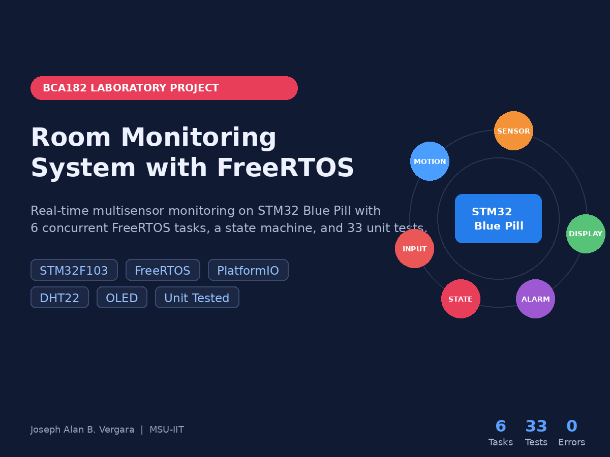

# BCA182 Real-Time Multisensor Room Monitoring System



## Project Overview

A real-time environmental monitoring system built on the **STM32 Blue Pill** using **FreeRTOS** and **PlatformIO**. The system monitors temperature, humidity, ambient light, and motion, displaying data on an SSD1306 OLED display with rotary encoder navigation. It features an ACTIVE/INACTIVE state machine: when no motion is detected the display replaces the sensor pages with a `SYSTEM INACTIVE` notice, so an empty room costs no I²C traffic for sensor rendering.

**Repository:** [github.com/Joal0816/BCA182-RoomMonitor](https://github.com/Joal0816/BCA182-RoomMonitor)

---

## Submission Artifacts

| Artifact | Link |
|---|---|
| **Laboratory Report (PDF)** | [docs/laboratory-report.pdf](docs/laboratory-report.pdf) |
| Laboratory Report (Markdown source) | [docs/laboratory-report.md](docs/laboratory-report.md) |
| Hackster.io write-up | [Real-Time Multisensor Room Monitoring System with FreeRTOS](https://www.hackster.io/554910/real-time-multisensor-room-monitoring-system-with-freertos-450a00) |
| Verification harness | [`tools/verify/run_all.sh`](tools/verify/run_all.sh) |
| Full source | [`src/`](src/), [`lib/`](lib/), [`test/`](test/) |

### Verification status

`bash tools/verify/run_all.sh` runs seven passes. Six execute on this machine and all pass:

| Pass | Result |
|---|---|
| Firmware builds for `bluepill_f103c8` and fits (RAM 77.1%, Flash 55.1%) | **PASS** |
| Patched port present, no PendSV store, pre-scheduler guards intact | **PASS** |
| 33 native unit tests | **PASS** |
| Static analysis, counts unchanged | **PASS** |
| Application-only size breakdown | **PASS** |
| `platformio.ini` consistent with `lib/` | **PASS** |
| Report PDF matches its Markdown | **PASS** |
| Wokwi diagram lint | *skipped* — needs `wokwi-cli` |

**Scheduler runtime — reproduced.** The firmware boots, starts the FreeRTOS scheduler and
enters all five tasks. This was replayed under **Renode 1.17.0** against this revision, where
the serial port emits:

```
[MAIN] System initialized
[MAIN] Starting FreeRTOS scheduler
[TASK] InputTask entered
[TASK] MotionTask entered
[TASK] AlarmTask entered
[TASK] SensorTask entered
[TASK] DisplayTask entered
```

An earlier revision stopped after its boot lines; the cause is documented as **L-07** in
[docs/limitations.md](docs/limitations.md). Wokwi is the intended end-to-end simulator and
its diagram lints cleanly offline, but the free CI quota was exhausted before a run could be
taken against the fixed revision. Renode was used instead because it models the NVIC, SysTick
and USART faithfully; it does **not** model the SSD1306 or the DHT22, so the per-peripheral
`Actual Result` entries in the report remain development-time observations. Physical-hardware
validation has not been performed.

---

## Features

- **Multi-sensor monitoring**: DHT22 (temperature/humidity), LDR (light), PIR (motion)
- **OLED display**: 4-page display with rotary encoder navigation
- **Temperature alarm**: Configurable buzzer alerts for out-of-range temperatures
- **Power management**: Automatic INACTIVE state after 15s of no motion
- **FreeRTOS architecture**: 5 concurrent tasks with proper priorities and synchronization
- **Modular design**: Separated HAL drivers, logic, and task implementations
- **Unit tested**: 33 automated tests for hardware-independent logic

---

## Learning Outcomes

This laboratory demonstrates:
- STM32 project creation with PlatformIO and STM32Cube framework
- Wokwi circuit simulation
- Sensor/actuator interfacing (DHT22, LDR, PIR, OLED, Encoder, Buzzer)
- FreeRTOS task management, priorities, and scheduling
- Inter-task communication (queues, event groups, mutexes)
- Periodic execution with `vTaskDelayUntil()`
- Embedded state machine implementation
- Hardware-independent unit testing
- Static code analysis
- Professional Git workflow and documentation

---

## System Architecture

```
                    ┌─────────────────────────────┐
                    │      STM32 Blue Pill         │
                    │       (FreeRTOS)             │
                    └──────────┬──────────────────┘
                               │
        ┌──────────────────────┼──────────────────────┐
        │                      │                      │
        ▼                      ▼                      ▼
  ┌──────────┐          ┌──────────┐          ┌──────────┐
  │SensorTask│          │InputTask │          │MotionTask│
  │  (Prio 2)│          │ (Prio 3) │          │ (Prio 3) │
  └────┬─────┘          └────┬─────┘          └────┬─────┘
       │                     │                     │
  ┌────▼─────┐          ┌────▼─────┐          ┌────▼─────┐
  │ DHT22    │          │ Encoder  │          │   PIR    │
  │ LDR      │          │          │          │          │
  └────┬─────┘          └────┬─────┘          └────┬─────┘
       │                     │                     │
       │              ┌──────▼──────┐              │
       │              │ Event Group │◄─────────────┘
       │              └──────┬──────┘
       │                     │
  ┌────▼─────────────────────▼────┐
  │         sensor_queue          │
  └────┬─────────────────────┬────┘
       │                     │
  ┌────▼─────┐          ┌────▼─────┐
  │AlarmTask │          │DisplayTask│
  │  (Prio 2)│          │  (Prio 1) │
  └────┬─────┘          └────┬─────┘
       │                     │
  ┌────▼─────┐          ┌────▼─────┐
  │  Buzzer  │          │   OLED   │
  └──────────┘          └──────────┘
```

---

## FreeRTOS Architecture

| Task | Responsibility | Trigger/Period | Priority | IPC | Typical Blocked Condition |
|------|---------------|----------------|----------|-----|--------------------------|
| SensorTask | Read DHT22 + LDR + PIR | 1 s periodic | 2 | `sensor_queue`, `display_sensor_queue` | `vTaskDelayUntil()` |
| DisplayTask | Manage OLED | 100 ms refresh | 1 | `display_sensor_queue`, `display_page_queue`, event group | `vTaskDelay()` |
| InputTask | Process encoder | Event-driven | 3 | Event Group | `ulTaskNotifyTake()` |
| MotionTask | Monitor PIR | Event-driven | 3 | Event Group | `ulTaskNotifyTake()` |
| AlarmTask | Evaluate alarm + control buzzer + advance state machine | Sensor update | 2 | `sensor_queue` | `xQueueReceive()` |

### Priority Justification

- **MotionTask & InputTask (Priority 3)**: User-facing inputs require immediate response. Motion detection drives the state machine; encoder input drives display navigation. Delay here causes perceptible lag.
- **SensorTask & AlarmTask (Priority 2)**: Sensor readings are periodic and can tolerate slight jitter. Alarm evaluation depends on fresh sensor data but doesn't need microsecond response.
- **DisplayTask (Priority 1)**: Display updates are cosmetic. The OLED can lag behind sensor data without affecting system correctness. Lowest priority prevents display operations from blocking safety-critical tasks.

### Synchronization Primitives

| Primitive | Type | Producer | Consumer | Purpose |
|-----------|------|----------|----------|---------|
| sensor_queue | Queue (depth 1) | SensorTask | AlarmTask | Latest SensorData_t for alarm evaluation |
| display_sensor_queue | Queue (depth 1) | SensorTask | DisplayTask | Latest SensorData_t for OLED rendering |
| display_page_queue | Queue (depth 1) | InputTask | DisplayTask | Current display page |
| event_group | Event Group | MotionTask, InputTask | DisplayTask | `MOTION_DETECTED_BIT`, `ENCODER_CW_BIT`, `ENCODER_CCW_BIT`, `ENCODER_BTN_BIT` |
| uart_mutex | Mutex | Any task | UART1 | Protect serial output from interleaving |

---

## Hardware / Simulated Components

| Component | STM32 Pin | Protocol | Purpose |
|-----------|-----------|----------|---------|
| DHT22 | PA1 | Digital (1-wire) | Temperature + Humidity |
| LDR (Photoresistor) | PA0 | ADC (CH0) | Ambient light level |
| PIR (HC-SR501) | PB0 | Digital (EXTI0) | Motion detection |
| SSD1306 OLED | PB6 (SCL), PB7 (SDA) | I2C1 | Display output |
| KY-040 Encoder | PA2 (CLK), PA3 (DT), PA4 (SW) | Digital (EXTI) | User input |
| Buzzer | PB8 | PWM (TIM4_CH3) | Alarm output |
| LED (onboard) | PC13 | GPIO | Status indicator |

---

## State Machine

```
                    ┌──────────────┐
          ┌────────►│    ACTIVE    │◄────────┐
          │         │              │         │
          │         │ Sensor page  │         │
          │         │ drawn        │         │
          │         │ Alarm active │         │
          │         └──────┬───────┘         │
          │                │                 │
          │     15s no motion                │
          │                │                 │
          │                ▼                 │
          │         ┌──────────────┐         │
          │         │   INACTIVE   │         │
          │         │              │         │
          │         │ "SYSTEM      │  PIR triggered
          │         │  INACTIVE"   │─────────┘
          │         │ drawn        │
          │         └──────────────┘
          │
          └─────────── Any PIR trigger
```

INACTIVE changes what the OLED renders; it suspends nothing. Every task keeps running at
its normal rate and priority, sampling and alarming exactly as it does in ACTIVE.

---

## Repository Structure

```
BCA182-RoomMonitor/
├── src/                          # Main firmware source
│   ├── main.c                    # Entry point, task creation
│   ├── main.h                    # Common definitions
│   ├── FreeRTOSConfig.h          # FreeRTOS configuration
│   ├── stm32f1xx_hal_conf.h      # HAL configuration
│   ├── app/
│   │   ├── hal/                  # Hardware abstraction drivers
│   │   │   ├── dht22.c/.h        # DHT22 sensor driver
│   │   │   ├── ldr.c/.h          # LDR ADC driver
│   │   │   ├── pir.c/.h          # PIR motion driver
│   │   │   ├── oled.c/.h         # SSD1306 OLED driver
│   │   │   ├── encoder.c/.h      # Rotary encoder driver
│   │   │   └── buzzer.c/.h       # Buzzer PWM driver
│   │   ├── tasks/                # FreeRTOS task implementations
│   │   │   ├── input_task.c/.h
│   │   │   ├── motion_task.c/.h
│   │   │   ├── sensor_task.c/.h
│   │   │   ├── alarm_task.c/.h
│   │   │   └── display_task.c/.h
│   │   └── logic/                # Hardware-independent logic
│   │       ├── state_machine.c/.h
│   │       ├── temperature.c/.h
│   │       └── alarm.c/.h
│   └── drivers/
│       └── uart_mutex.c/.h       # UART mutex wrapper
├── include/
│   └── README                    # PlatformIO include directory
├── test/
│   ├── test_temperature/         # 15 temperature boundary tests
│   ├── test_encoder/             # 10 encoder navigation tests
│   └── test_state_machine/       # 8 state machine tests
├── docs/
│   ├── laboratory-report.md      # Academic report
│   ├── functional-verification.md
│   ├── fault-experiments.md
│   ├── static-analysis.md
│   ├── requirements-traceability.md
│   └── limitations.md            # Known limitations & workarounds
├── diagram.json                  # Wokwi circuit diagram
├── wokwi.toml                    # Wokwi configuration
├── platformio.ini                # PlatformIO configuration
└── README.md
```

---

## Getting Started

### Prerequisites
- [PlatformIO CLI](https://platformio.org/install/cli) or PlatformIO IDE for VSCode
- Git
- (Optional) ST-Link V2 programmer for hardware testing

### Build Firmware
```bash
git clone https://github.com/Joal0816/BCA182-RoomMonitor.git
cd BCA182-RoomMonitor
pio run
```

### Run Unit Tests
```bash
# Run on PC (no hardware needed)
pio test -e native

# Run on hardware (requires STM32 + ST-Link)
pio test -e bluepill_f103c8
```

> **Use `pio test`, not `pio run`, for the native environment.** `[env:native]`
> exists only to run `test/` on the host PC; its `src/` is excluded, because 16 of
> the 17 translation units under `src/` reach `stm32f1xx_hal.h` — the six driver
> headers in `src/app/hal/` and `src/main.h` include it directly, everything else
> inheriting it through `main.h`, leaving only `src/drivers/diag.c` without it —
> and there is no STM32Cube HAL for a native build. `platformio.ini` sets
> `default_envs = bluepill_f103c8` so that a bare `pio run` builds only the
> firmware — without it, `pio run` would also try the native environment, fail on
> the missing HAL header, and report `FAILED` even though the firmware built
> correctly.

### Static Analysis
```bash
pio check
```

---

## Running the Wokwi Simulation

The project is simulated in Wokwi with all peripherals wired, including USART1 serial output (via `$serialMonitor`) and the SSD1306 OLED display (via bulk I2C buffer transmission).

> **Status:** the simulation was used throughout development to iterate on the firmware. A later replay against a revision that still carried the scheduler hang reproduced no run — every session emitted its boot lines and then stopped, with no task started. That hang has since been root-caused and fixed, and the fixed firmware was replayed successfully under Renode, where all five tasks are entered (renode is used because it models the NVIC, SysTick and USART faithfully; it does not model the SSD1306 or DHT22, so the per-peripheral observations quoted in [docs/functional-verification.md](docs/functional-verification.md) remain development-time notes). See [docs/limitations.md](docs/limitations.md) L-07 for the evidence.
>
> What *is* re-runnable on the current revision without the simulator: the 7-pass local harness (`tools/verify/run_all.sh`), the 33 native unit tests, and the static analysis. All pass.

The schematic below is generated directly from `diagram.json` and shows all 9 components and 25 connections as they are wired in the simulator.

> **Note:** `diagram.json` uses the Blue Pill's short header labels (`A0`, `A1`, `A9`, `3V3.1`, `5V.1`, `GND.1`). Wokwi does not recognise long-form names such as `mcu:PA9` or `mcu:3.3V` and **silently discards those wires** without reporting an error.


### Option 1: VSCode Extension (Recommended)
1. Install the "Wokwi Simulator" extension in VSCode
2. Open this project directory
3. Press `F1` and select **Wokwi: Start Simulator** (or click `diagram.json` and press the Play button)
4. Interact with the circuit:
   - Click the DHT22 to adjust temperature/humidity sliders
   - Click the KY-040 rotary encoder to rotate clockwise/counter-clockwise or press its button
   - Click the PIR sensor to trigger simulated motion
   - Observe the OLED display render 4 distinct pages and view real-time serial output in the terminal

#### Verifying a Build End to End

Wokwi never compiles the firmware — it loads whatever `pio run` last produced. A stale or unpatched binary therefore looks exactly like a firmware bug. Run these steps in order.

**1. Clean rebuild.**

```bash
pio run -t clean && pio run
```

**2. Confirm the port fix is in the image.** The build log must contain:

```
[port-patch] OK: patched ARM_CM3 port.o + include/portmacro.h in the image, no ICSR PendSV store, pre-scheduler critical sections deferred
```

That single line asserts four things: the patched port object is in the build, `include/portmacro.h` still redirects every macro the kernel core needs, the linked image contains no store to the ICSR at `0xE000ED04` (the PendSV-yield escape described in Challenge 4 of the report), and both critical-section primitives still carry their pre-scheduler guard. If it instead prints `[port-patch] WARNING: ...`, one of those four has regressed and the firmware will print its boot lines and then stop. A `multiple definition` link error is the *intended* loud failure and means the patch did not shadow the stock port — see [docs/limitations.md](docs/limitations.md) L-07.

**3. Start the simulator** as described in Option 1 above.

**4. Open the Serial Monitor tab.** This is a separate tab in the Wokwi panel, next to the diagram view. If it is closed, the firmware can be printing perfectly and you will still see nothing.

**5. Let it run for at least 15 seconds.** The scheduler starts first and the tasks stagger in afterwards; judging the run in the first two seconds is misleading.

**6. Read the result.**

| Observation | Meaning |
|-------------|---------|
| All five `[TASK] … entered` lines appear, and the OLED shows `Initializing...` within ~1 s | Working. The scheduler started and every task is running. |
| `[TASK] SensorTask entered` and `[SENSOR] T=25.0C H=50.0% L=500 M=0` | Working, and the float formatter is linked. |
| The `[DIAG] VTOR` line and the two `[MAIN]` lines, then silence | The boot path through `vTaskStartScheduler()` completes but no task is entered. This was the project's own symptom and it is now **fixed** — if you see it, the binary is stale or the port patch is missing, so re-run step 1 and confirm step 2. History and evidence: L-07 in [docs/limitations.md](docs/limitations.md). |
| `[MAIN] FATAL: xTaskCreate failed` or `ASSERT:`/`[FATAL]` output | A specific failure was detected and reported. The message names it. |
| `[OLED] init failed: no ACK from 0x3C` | The panel is not acknowledging. A wiring or simulator fault, not a software one. |
| `[SENSOR] T=0.0C H=0.0%` or garbage digits | The `%f` formatter is not linked; check `-Wl,-u,_printf_float` in `platformio.ini`. |
| Serial monitor completely empty | The monitor tab is almost certainly closed. Recheck step 4. |

> **Caution when interpreting a silent run.** Wokwi's CLI can also drop the transport
> mid-session (`API Error: Connection to transport closed unexpectedly: code 1006`) and the
> serial log file is truncated at a fixed size if the client is killed, which can leave a
> partial trailing token that looks like real output. Treat any observation taken from a
> killed or error-terminated session as inconclusive and re-run it.

The onboard LED should stay **off** throughout. It is wired active-low and PC13 is driven HIGH at boot, so a lit LED at rest indicates a wiring error rather than normal operation.

### Option 2: Physical Hardware Validation
The same firmware binary (`.pio/build/bluepill_f103c8/firmware.bin`) can be flashed to an STM32F103C8T6 Blue Pill board via ST-Link V2 using `pio run -e bluepill_f103c8 -t upload`.

#### ST-Link V2 → Blue Pill Wiring

The Blue Pill exposes SWD on the 4-pin header at the end opposite the USB connector, silkscreened `3V3 / SWDIO / SWCLK / GND` (or `VCC / DIO / CLK / GND`). A bare ST-Link V2 clone labels its 10-pin housing `3.3V / SWDIO / SWCLK / GND` on one side.

| ST-Link V2 | Blue Pill SWD header | Notes |
|------------|----------------------|-------|
| `3.3V` | `3V3` | Target must be powered — do **not** fit the BOOT0 jumper alone and expect the debugger to power the board through SWD. |
| `GND` | `GND` | Always connect the common ground first. |
| `SWDIO` | `SWDIO` (PA13) | Bidirectional data. |
| `SWCLK` | `SWCLK` (PA14) | Clock. |
| `RST` | `RST` | Optional but recommended; enables connect-under-reset when a running image holds the bus. |

> **Warning:** The ST-Link `5V` pin and the Blue Pill `5V` pin are **not** part of the SWD harness. `platformio.ini` sets `upload_protocol = stlink` and `upload_port = swd`, so the debugger attaches over the SWD pins only. Never bridge the 3.3 V rail to the 5 V rail.

Neither PA13 (SWDIO) nor PA14 (SWCLK) is used by the application, and the firmware contains no SWJ-disable or AFIO remap calls, so the debug port stays available after reset. The only pin driven outside the peripheral set is PC13 (onboard LED).

Switching between the simulator and real hardware requires no source changes:

1. Wire the ST-Link as above and plug it into USB.
2. Move the BOOT0 jumper to `0` (the normal run position) so the board boots the flashed image.
3. Run `pio run -e bluepill_f103c8 -t upload`.
4. Open the serial monitor with `pio device monitor -b 115200` to read the USART1 output on PA9/PA10.

---

## Unit Testing

### Test Coverage

| Test Suite | Tests | What It Verifies |
|------------|-------|------------------|
| test_temperature | 15 | Boundary conditions: <18°C, =18°C, normal, =30°C, >30°C |
| test_encoder | 10 | Navigation: increment, decrement, wrap-around CW/CCW |
| test_state_machine | 8 | Transitions: ACTIVE→INACTIVE, INACTIVE→ACTIVE, continuous motion |

### Run Tests
```bash
pio test -e native
```

---

## Static Code Analysis

```bash
pio check
```

**Results:** 0 functional defects, 21 LOW-severity clang-tidy advisories (plus 1 compiler sign-compare warning and 2 benign memory-mapped-register findings).

The advisories are `bugprone-narrowing-conversions` (10) and `bugprone-easily-swappable-parameters` (7) in `src/app/hal/oled.c`, `cert-err33-c` (3) in `src/app/tasks/display_task.c`, and `cert-err33-c` (1) in `src/drivers/uart_mutex.c` — all for deliberately discarded bounded `snprintf`/`vsnprintf` return values. The two static-analyzer findings are both `core.FixedAddressDereference` — a direct memory-mapped peripheral access, which is how embedded code addresses hardware and not a defect. One is the DWT cycle-counter access in `dht22.c`; the other is the vector-table read in `diag.c`, written in a form the analyzer cannot fold into a constant so that the relocation stays visible. No correctness or safety issue was detected. `pio check` delegates to `cppcheck`; the findings above were produced with `clang-tidy`.

See [docs/static-analysis.md](docs/static-analysis.md) for complete findings table.

### Reproduce These Results Locally

The `tools/verify/` harness re-runs the analysis above without PlatformIO or the
vendor ARM toolchain, using only `gcc`, `clang`, `clang-tidy` and `python3`:

```bash
./tools/verify/run_tests.sh           # 33/33 native unit tests
./tools/verify/run_static_analysis.sh # 0 defects, 21 advisories, 1 warning, 2 benign MMIO findings
./tools/verify/run_size_analysis.sh   # cross-compile src/ for Cortex-M3 and report section sizes
```

See [tools/verify/README.md](tools/verify/README.md) for what the harness covers and
what it deliberately does not.

---

## Functional Verification

Each row below is a procedure from [docs/functional-verification.md](docs/functional-verification.md).
The **Expected Result** column states the outcome the source code produces; it was verified by
reading the code path that implements it, not by replaying the current revision in the
simulator.

| Test ID | Stimulus | Expected Result | Verified against |
|---------|----------|-----------------|------------------|
| FT-01 | Set temp to 25°C | `25.0 C` displayed | `display_task.c` `DrawTemperaturePage`; `%.1f` formatting in `temperature.c` |
| FT-02 | Set humidity to 60% | `60.0 %` displayed | `display_task.c` `DrawHumidityPage` |
| FT-03 | Cover LDR | Light page value drops | `ldr.c` ADC scaling; `DrawLightPage` |
| FT-04 | Rotate encoder CW | Next page selected | `encoder.c` EXTI → `ENCODER_CW_BIT`; `input_task.c` |
| FT-05 | Rotate encoder CCW | Previous page selected | `encoder.c` EXTI → `ENCODER_CCW_BIT`; `input_task.c` |
| FT-06 | Set temp > 30°C | Alarm activates, buzzer sounds | `alarm.c` threshold; `alarm_task.c` buzzer drive |
| FT-07 | Return temp to normal | Alarm clears, buzzer silent | `alarm.c` hysteresis; `alarm_task.c` |
| FT-08 | Trigger PIR while INACTIVE | System returns to ACTIVE | `motion_task.c` → `MOTION_DETECTED_BIT`; `state_machine.c` |
| FT-09 | Wait 15 s without motion | INACTIVE; OLED shows `SYSTEM INACTIVE` | `state_machine.c` timeout; `display_task.c:107-108` |
| FT-10 | Run all tasks for 60 min | No deadlock or starvation | Task priorities and queue depths in `main.c` |

> **Status note:** the `Actual Result` column was removed. Those entries recorded
> development-time observations and could not all have held for the current revision — most
> importantly, the decimal values in FT-01 and FT-02 could not have appeared before
> `-Wl,-u,_printf_float` was added to `platformio.ini`, because the default newlib-nano
> `printf` does not implement `%f`. See
> [docs/functional-verification.md](docs/functional-verification.md) for what was and was
> not observed.

See [docs/functional-verification.md](docs/functional-verification.md) for the full step-by-step procedures and expected results.

> **Test-ID note:** an earlier revision of this table used `FT-01…FT-10` for a Wokwi
> stimulus checklist that differed from the canonical procedures in
> [docs/functional-verification.md](docs/functional-verification.md). That stimulus
> checklist now lives in the report's §5.2 as **WF-01…WF-10**, and `FT-01…FT-10` is
> reserved for the canonical procedures.

---

## Engineering Decisions

### Why vTaskDelayUntil() over vTaskDelay()
`vTaskDelayUntil()` provides precise periodic execution by measuring from the start of each period, compensating for task execution time. `vTaskDelay()` introduces drift because it delays from the moment it's called, adding execution time to each period.

### Why Separate HAL from Logic
Hardware drivers (DHT22, LDR, etc.) are isolated from decision logic (temperature evaluation, state machine). This enables unit testing of pure logic without hardware dependencies.

### Why Event Group for Motion
Motion detection drives both the state machine and display updates. An event group allows multiple consumers to check the same event without polling, and bits can be set/cleared atomically from ISR context.

### Why Mutex for UART
Multiple tasks print diagnostic messages. Without a mutex, outputs interleave mid-line, producing unreadable garbage. The mutex ensures each print completes atomically.

---

## Limitations

For a comprehensive analysis of all project limitations, their impact, mitigation strategies, and risk assessment, see [docs/limitations.md](docs/limitations.md).

Key limitations include:

- **DHT22 critical section**: The 1-wire protocol requires precise microsecond timing with interrupts masked, blocking SensorTask for ~5ms during readout (acceptable given the 2s sampling period)
- **Single buzzer alarm**: Currently only temperature threshold violations trigger the acoustic buzzer; humidity and motion alarms are visual-only
- **No persistent storage**: Environmental telemetry is maintained in RAM and not logged to flash or external EEPROM/SD
- **Fixed compile-time priorities**: Task priorities are statically declared in firmware rather than dynamically adjusted at runtime
- **LDR uncalibrated**: Light readings represent relative percentage based on ADC voltage division rather than calibrated lux
- **Memory constraints**: STM32F103C8 has 20KB SRAM; FreeRTOS heap is sized at 12KB with carefully tuned task stacks

---

## Future Improvements

- Add WiFi/Bluetooth connectivity for remote monitoring
- Implement data logging to SD card
- Add more sensors (barometric pressure, UV index)
- Implement adaptive alarm thresholds
- Add OTA firmware update capability

---

## References

- [FreeRTOS Documentation](https://www.freertos.org/Documentation.html)
- [STM32 HAL Documentation](https://www.st.com/en/embedded-software/stm32cubef1.html)
- [PlatformIO STM32Cube Framework](https://docs.platformio.org/en/latest/frameworks/stm32cube.html)
- [Wokwi Documentation](https://docs.wokwi.com/)
- BCA182 Embedded Systems Programming - Laboratory Activity 1

---

## Acknowledgments

- **Asst. Prof. Paul Rodolf P. Castor, M.Sc.** - Course instructor
- **Mindanao State University - Iligan Institute of Technology** - College of Computer Studies
- **Department of Computer Applications**
