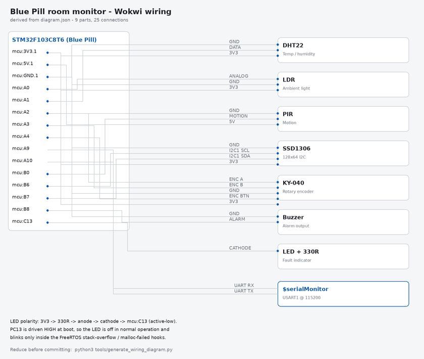

# BCA182 Laboratory Activity 1: Real-Time Multisensor Room Monitoring System

**Laboratory Report**

| | |
|---|---|
| **Author** | Joseph Alan B. Vergara |
| **Date** | September 2026 |
| **Institution** | Mindanao State University – Iligan Institute of Technology |
| **Department** | College of Computer Studies, Department of Computer Applications |
| **Course** | BCA182 Embedded Systems Programming |

---

## Table of Contents

1. [Problem Statement and Requirements](#1-problem-statement-and-requirements)
2. [System Architecture and Design](#2-system-architecture-and-design)
3. [FreeRTOS Architecture](#3-freertos-architecture)
4. [Implementation](#4-implementation)
5. [Verification and Testing](#5-verification-and-testing)
6. [Static Code Analysis](#6-static-code-analysis)
7. [Engineering Discussion](#7-engineering-discussion)
8. [Conclusion](#8-conclusion)

---

## 1. Problem Statement and Requirements

### 1.1 Problem Statement

Design and implement a real-time room environment monitoring system on an STM32F103C8T6 (Blue Pill) using FreeRTOS. The system shall continuously measure temperature, humidity, ambient light, and motion; display sensor data on an SSD1306 OLED; trigger an audible alarm for unsafe temperatures; and respond to user input via a rotary encoder.

### 1.2 Functional Requirements

| ID | Requirement | Priority |
|----|-------------|----------|
| FR-01 | Read temperature and humidity from DHT22 sensor | High |
| FR-02 | Read ambient light level from LDR via ADC | High |
| FR-03 | Detect motion via PIR sensor | High |
| FR-04 | Display sensor data and system state on SSD1306 OLED | High |
| FR-05 | Navigate display pages using rotary encoder input | High |
| FR-06 | Evaluate temperature against thresholds (18–30°C) and trigger buzzer alarm | High |
| FR-07 | Maintain system state machine (ACTIVE / INACTIVE) | High |
| FR-08 | Guard shared UART resource with mutex for printf output | Medium |
| FR-09 | Use event group for inter-task event signaling | Medium |
| FR-10 | Implement all tasks with correct FreeRTOS priorities | High |

### 1.3 Non-Functional Requirements

- **Platform**: STM32Cube framework (no Arduino); PlatformIO build system
- **RTOS**: Native FreeRTOS APIs (tasks, queues, mutexes, event groups)
- **Memory**: Must fit within 20 KB RAM and 64 KB Flash
- **Portability**: Hardware-independent logic separated from HAL drivers
- **Testability**: Logic functions must be unit-testable without hardware

---

## 2. System Architecture and Design

### 2.1 Hardware Architecture

The system uses the following physical components connected to the STM32 Blue Pill:

| Component | Interface | STM32 Pin(s) | Notes |
|-----------|-----------|-------------|-------|
| DHT22 (temp/humidity) | Digital 1-wire | PA1 | 4.7 kΩ pull-up to 3.3V |
| LDR (photoresistor) | Analog / ADC | PA0 (ADC1_CH0) | Voltage divider with 10 kΩ |
| PIR sensor (HC-SR501) | Digital EXTI | PB0 (EXTI0) | 5V supply, digital OUT |
| SSD1306 OLED (I2C) | I2C | PB6 (SCL), PB7 (SDA) | I2C1, 0x3C address |
| KY-040 Rotary Encoder | Digital EXTI | PA2 (CLK/EXTI2), PA3 (DT), PA4 (SW/EXTI4) | |
| Buzzer | PWM (TIM4_CH3) | PB8 | Timer-based PWM |
| USART1 (debug serial) | UART | PA9 (TX), PA10 (RX) | 115200 baud |
| Onboard LED | GPIO | PC13 | Active-low; driven **high** at boot by `MX_GPIO_Init()`, which turns it off. Not driven in normal operation — only toggled by the stack-overflow and malloc-failed hooks |
| ST-Link V2 (programming) | SWD | PA13 (SWDIO), PA14 (SWCLK), NRST (optional) | 3.3V + GND reference; not used at runtime |

All peripherals except PIR operate at 3.3V. PIR supply uses the 5V rail. The I2C bus requires open-drain configuration with pull-ups (4.7 kΩ to 3.3V on PB6 and PB7).

The ST-Link V2 connects to the 4-pin SWD header (`3V3 / SWDIO / SWCLK / GND`) at the end of the board opposite the USB connector, with the optional `RST` line wired to `NRST`. Only `3.3V` and `GND` are used for reference; the ST-Link `5V` pin is left unconnected. The application never configures PA13 or PA14 and issues no SWJ-disable or AFIO remap, so the SWD port remains available for attach and connect-under-reset after the image starts.

<figure>

<figcaption><strong>Figure 2.1</strong> &mdash; System wiring as defined by <code>diagram.json</code> and rendered directly from it. Net labels are the Wokwi pin names used by the simulator (for example <code>A9</code>, <code>A10</code>, <code>3V3.1</code>).</figcaption>
</figure>

### 2.2 Software Architecture

The application follows a modular three-layer architecture:

```
┌────────────────────────────────────────────────┐
│            Application Layer (Tasks)            │
│  SensorTask  InputTask  MotionTask  AlarmTask  DisplayTask │
└──────────────────────┬─────────────────────────┘
                       │ FreeRTOS IPC (queues, mutex, event group)
┌──────────────────────▼─────────────────────────┐
│            Logic Layer (Hardware-Independent)   │
│  state_machine.c  temperature.c  alarm.c        │
└──────────────────────┬─────────────────────────┘
                       │ HAL API calls
┌──────────────────────▼─────────────────────────┐
│            HAL Driver Layer                     │
│  dht22.c  ldr.c  pir.c  oled.c  encoder.c  buzzer.c │
└────────────────────────────────────────────────┘
```

Source is organized as:
- `src/app/tasks/` — FreeRTOS task implementations
- `src/app/logic/` — Hardware-independent logic (testable without hardware)
- `src/app/hal/` — HAL drivers for each peripheral
- `src/drivers/uart_mutex.c` — Shared UART wrapper with mutex

### 2.3 FreeRTOS Communication Architecture

```
  EXTI ISR (PB0 / PA2 / PA4)
        │  vTaskNotifyGiveFromISR()
        ├───────────────► InputTask ──xQueueOverwrite──► display_page_queue ──► DisplayTask
        │                                │
        └───────────────► MotionTask     └──xEventGroupSetBits──► event_group ──► DisplayTask
                              │                                                 (clears bits)
                              └──xEventGroupSetBits──► event_group

  SensorTask ──xQueueOverwrite──► sensor_queue ─────────► AlarmTask ──► Buzzer
      │                                                        └────► StateMachine_Update()
      └────────xQueueOverwrite──► display_sensor_queue ────► DisplayTask ──► OLED
```

**Design decision: queue fan-out.** A single depth-1 queue was initially read by both
AlarmTask and DisplayTask with `xQueueReceive()`. Whichever task dequeued first consumed
the sample and the other had to wait for the next one a full second later, so each consumer
saw roughly half the samples. The fix was to give each consumer its own depth-1 queue
(`sensor_queue` for AlarmTask, `display_sensor_queue` for DisplayTask). SensorTask
publishes to both with `xQueueOverwrite()`, which never blocks — a slow consumer simply
misses intermediate samples and always reads the freshest one. `InputTask` similarly
overwrites `display_page_queue`, so rapid encoder turns collapse to the final page.

### 2.4 State Machine

```
START ──► ACTIVE ────── 15 s with no motion ──────► INACTIVE
           ▲                                           │
           │                                           │
           └──────────── motion detected ──────────────┘

  ACTIVE                          INACTIVE
  · SensorTask samples @ 1 s      · SensorTask samples @ 1 s
  · AlarmTask evaluates @ 1 s     · AlarmTask evaluates @ 1 s
  · OLED renders sensor page      · OLED renders "SYSTEM INACTIVE"
```

`StateMachine_Init()` starts the system in `STATE_ACTIVE` (there is no power-on INACTIVE
state). `StateMachine_Update()` is called from **AlarmTask**, once per sample received from
`sensor_queue` — that is, at most once per second, since `SensorTask` is the only producer.
It takes `motion_detected` from the sample and:

- clears the timer and forces `STATE_ACTIVE` whenever motion is present;
- otherwise, if the state is `ACTIVE` and `now - last_motion_tick >= INACTIVE_TIMEOUT_MS`
  (15 000 ms), moves to `STATE_INACTIVE`.

Because the check only runs when a sample arrives, the observed transition lands in the
15–16 s window rather than at exactly 15 s. `DisplayTask` calls `StateMachine_GetState()`
and renders either the selected sensor page or the `SYSTEM / INACTIVE` screen. The state
variable itself lives in `StateMachine_t`, a file-scope struct in `src/main.c` shared by
pointer — there is no queue for it.

Note what INACTIVE does *not* do: it is a display state, not a power or scheduling state.
`SensorTask` and `AlarmTask` keep running at full rate, sampling and evaluating thresholds
exactly as before, so temperature alarms still fire while the panel is showing
`SYSTEM INACTIVE`. `DisplayTask` also keeps running: it stops drawing the sensor pages but
continues to refresh the `SYSTEM` / `INACTIVE` screen at `DISPLAY_REFRESH_MS`. Nothing is
powered down, no task is suspended, and the panel is not blanked — only the rendered content
changes.

---

## 3. FreeRTOS Architecture

### 3.1 Task Configuration

| Task | Responsibility | Trigger / Period | Priority | IPC Used | Typical Blocked Condition |
|------|---------------|-----------------|----------|----------|--------------------------|
| SensorTask | Read DHT22 + LDR + PIR; publish to both queues | 1 s periodic (`vTaskDelayUntil`) | 2 | `sensor_queue`, `display_sensor_queue` | `vTaskDelayUntil()` |
| DisplayTask | Receive sensor data; drive OLED; handle page navigation | 100 ms redraw + on-demand page update | 1 | `display_sensor_queue`, `display_page_queue`, `event_group` | `vTaskDelay()` (after non-blocking `xQueueReceive(..., 0)`) |
| InputTask | Read encoder; detect rotation and button; signal DisplayTask | Notification-driven (EXTI PA2 / PA4) | 3 | `display_page_queue`, `event_group` | `ulTaskNotifyTake()` (portMAX_DELAY) |
| MotionTask | Monitor PIR; signal motion event | Notification-driven (EXTI PB0) | 3 | `event_group` | `ulTaskNotifyTake()` (portMAX_DELAY) |
| AlarmTask | Receive sensor data; evaluate temperature; control buzzer; advance state machine | On queue item, polled every 500 ms | 2 | `sensor_queue` | `xQueueReceive()` (500 ms timeout) |

### 3.2 Priority Justification

**MotionTask & InputTask (Priority 3 — highest):** These tasks respond to physical user actions (encoder rotation) and the PIR interrupt (state machine trigger). Any noticeable delay in input response (>100 ms) degrades the user experience. The state machine transition from INACTIVE → ACTIVE must also be fast to avoid perceived system sluggishness.

**SensorTask & AlarmTask (Priority 2 — medium):** Sensor acquisition has a 1-second period; jitter of tens of milliseconds is imperceptible. AlarmTask must evaluate new data promptly but has a natural latency of one sensor period (1 s), so priority 2 is appropriate. AlarmTask also advances the state machine on each sample, which is why it shares SensorTask's priority rather than running lower.

**DisplayTask (Priority 1 — lowest):** Display rendering is cosmetic. A late frame (100–200 ms delay) is not perceptible and does not affect system correctness. Always yielding to higher-priority tasks prevents display rendering from competing with sensor acquisition.

**What if priorities were wrong:** If DisplayTask ran at priority 3, it would preempt SensorTask during I2C OLED writes (the ordering failure analysed in Fault Experiment 2, section 5.3), causing DHT22 read failures and delayed alarm evaluation.

### 3.3 Synchronization Primitives

| Primitive | Type | Producer | Consumer | Purpose |
|-----------|------|----------|----------|---------|
| `sensor_queue` | Queue (depth 1) | SensorTask | AlarmTask | Deliver latest `SensorData_t` for alarm evaluation and state-machine advance |
| `display_sensor_queue` | Queue (depth 1) | SensorTask | DisplayTask | Deliver latest `SensorData_t` for OLED rendering |
| `display_page_queue` | Queue (depth 1) | InputTask | DisplayTask | Deliver the currently selected `DisplayPage_t` |
| `event_group` | EventGroupHandle_t | InputTask, MotionTask | DisplayTask | Signal page-change events (encoder CW/CCW/BTN) and motion events |
| `uart_mutex` | Mutex | — | All tasks | Protect UART output from concurrent writes (race condition prevention) |

Both sensor payload queues are depth 1 and are written with `xQueueOverwrite()`, so a slow
consumer never stalls SensorTask: it simply misses intermediate samples and always reads the
freshest one. `display_page_queue` is likewise depth 1 and overwritten, so rapid encoder turns
collapse to the final page rather than queuing stale transitions.

### 3.4 Task States Observed

- **Running**: SensorTask while executing `DHT22_Read()` or `LDR_Read()`
- **Blocked**: SensorTask between sensor reads (inside `vTaskDelayUntil()` for 1 s), and
  for `SENSOR_SETTLE_MS` at startup while the DHT22 settles
- **Blocked (indefinite)**: InputTask and MotionTask inside `ulTaskNotifyTake()` until an EXTI
  interrupt notifies them; this is why they can hold the highest priority without starving others
- **Blocked (timeout)**: AlarmTask inside `xQueueReceive()` waiting for the next sample, with a
  500 ms timeout so it still runs if sensor publication stalls
- **Ready**: AlarmTask between the moment SensorTask sends to the queue and AlarmTask is scheduled
- **Suspended**: Not used in this design (no explicit `vTaskSuspend()` calls)
- **Deleted**: Not used (all tasks run indefinitely)

### 3.5 vTaskDelayUntil() Usage

SensorTask uses `vTaskDelayUntil()` for periodic execution:

```c
const TickType_t xPeriod = pdMS_TO_TICKS(SENSOR_READ_PERIOD_MS);   /* 1000 ms */

/* Absorb the DHT22 settling time that DHT22_Init no longer blocks on. */
vTaskDelay(pdMS_TO_TICKS(SENSOR_SETTLE_MS));

/* Captured after the settle delay, so the first iteration does not find its
   deadline already passed and return immediately. */
TickType_t xLastWakeTime = xTaskGetTickCount();

for (;;) {
    SensorData_t data;
    /* ... DHT22_Read(), LDR_Read(), PIR_GetState() populate data ... */

    if (read_ok) {
        xQueueOverwrite(params->alarm_queue, &data);
        xQueueOverwrite(params->display_queue, &data);
    }

    vTaskDelayUntil(&xLastWakeTime, xPeriod);
}
```

The wake time is captured once *before* the loop, so it is not re-initialised each iteration. `vTaskDelayUntil()` measures the period from the **start** of each iteration: even if `DHT22_Read()` holds the CPU for ~20 ms, the next wake time is still 1000 ms from the previous wake and no drift accumulates. `vTaskDelay()` would delay 1000 ms **after** the read completes, so the sampling period would stretch by the execution time of every iteration.

Note that `vTaskDelayUntil()` is the only periodic-delay call in the design. `MotionTask` and `InputTask` block indefinitely in `ulTaskNotifyTake()` and are released by the EXTI callbacks; `DisplayTask` calls `vTaskDelay(DISPLAY_REFRESH_MS)` *after* draining its queues non-blockingly.

---

## 4. Implementation

### 4.1 Key Design Decisions

**vTaskDelayUntil() for periodic sampling:** As explained in Section 3.5, this eliminates accumulated drift in the 1-second sampling period. At 1,000 ms per sample a 24-hour run performs about 86,400 iterations; the DHT22 read holds the CPU for ~20 ms (`DHT22_Delay_us(18000)` alone accounts for 18 ms), so with `vTaskDelay()` each iteration would add that time, stretching the period to ~1,020 ms and losing up to ~1,728 seconds (≈29 minutes) of sampling cadence over the day. `vTaskDelayUntil()` keeps the period at a stable 1,000 ms regardless of execution time.

**Separation of HAL from logic:** Hardware drivers (`src/app/hal/`) contain only peripheral access code (I2C writes, ADC reads, GPIO operations), while `src/app/logic/` holds the decision functions and the task bodies that call them. The `.c` files in the logic layer themselves call no HAL routines — they operate on plain values such as `float temperature` and `uint8_t motion_detected` — but their headers reach `main.h`, which pulls in `stm32f1xx_hal.h` and the FreeRTOS headers for the shared types and constants. That compile-time coupling is what keeps the tests off the production sources: each test transcribes the logic it exercises and compiles standalone, so the 33 unit tests run on the host PC (the `native` PlatformIO environment) without STM32 headers or hardware.

**Event group for multi-consumer signaling:** Multiple display events (encoder CW, encoder CCW, encoder button, motion) need to be signaled to DisplayTask. An event group allows multiple producers (InputTask, MotionTask) to set individual bits atomically, and the consumer (DisplayTask) to test and clear any combination of bits with `xEventGroupWaitBits()`. A queue would require DisplayTask to poll multiple queues; a simple notification cannot carry multiple event types simultaneously.

**Mutex for UART protection:** `printf` is not thread-safe. Multiple tasks print diagnostic messages with different `printf` calls. Without the mutex, two tasks can simultaneously write to the UART transmit buffer, interleaving their output mid-line (the mechanism analysed in Fault Experiment 3, section 5.3). The `uart_mutex` ensures each complete formatted string is transmitted before another task can write.

**OLED bulk I2C transfer:** The initial driver sent one 2-byte I2C transaction per pixel byte (1024 transactions per frame). This caused the Wokwi I2C simulation to stall. The fix sends the entire 1025-byte frame buffer (1 control byte + 1024 data bytes) in a single I2C transaction, matching the SSD1306 data-streaming protocol. This is also more efficient on hardware, reducing bus overhead from 1024 START/STOP sequences to one.

**Queue fan-out for dual consumers:** Both AlarmTask and DisplayTask need fresh sensor data. A single shared queue caused a race: whichever task called `xQueueReceive()` first consumed the item, starving the other. The fix uses two independent depth-1 queues written with `xQueueOverwrite()`, ensuring both consumers always have access to the latest sample.

**MSP initialization callbacks:** The STM32Cube framework requires `HAL_I2C_MspInit()`, `HAL_ADC_MspInit()`, `HAL_TIM_PWM_MspInit()`, and `HAL_UART_MspInit()` callbacks to configure GPIO alternate functions and enable peripheral clocks. Without these, peripheral initialization silently fails. All four callbacks were implemented in `main.c`.

### 4.2 Source Organization

The entire application is distributed across multiple modules. `main.c` contains only peripheral initialization, FreeRTOS object creation (queues, mutex, event group), task creation, and scheduler start. No application logic resides in `main.c`.

```
src/
├── main.c                    # Entry point, peripheral init, task creation
├── FreeRTOSConfig.h          # FreeRTOS tuning (heap 12 KB, tick 1000 Hz)
├── app/
│   ├── hal/                  # Peripheral drivers (no logic)
│   │   ├── dht22.c/.h        # DHT22 single-wire driver
│   │   ├── ldr.c/.h          # LDR ADC driver
│   │   ├── pir.c/.h          # PIR EXTI driver
│   │   ├── oled.c/.h         # SSD1306 I2C driver (returns HAL_StatusTypeDef)
│   │   ├── encoder.c/.h      # KY-040 encoder driver
│   │   └── buzzer.c/.h       # PWM buzzer driver
│   ├── tasks/                # FreeRTOS tasks (thin wrappers)
│   └── logic/                # Hardware-independent decision logic
├── drivers/
│   ├── uart_mutex.c/.h       # UART write with mutex
│   └── diag.c/.h             # Vector-table relocation and fault reporting
```

---

## 5. Verification and Testing

### 5.1 Unit Test Results

All 33 tests pass on the native host PC environment (`pio test -e native`, configured in
`platformio.ini`). The counts below were re-verified during this audit by compiling each
suite on the host with GCC and running it; every suite passed with no failures. The audit
environment has no system C headers installed, so the suites were linked against a minimal
local `unity.h` shim providing `TEST_ASSERT_*`, `RUN_TEST`, and `UNITY_BEGIN`/`UNITY_END`
rather than the vendored Unity sources under `.pio/libdeps/`. The test bodies were compiled
unmodified.

| Test Suite | Tests | What It Verifies | Status |
|-----------|-------|-----------------|--------|
| `test_temperature` | 15 | Boundary conditions: below 18°C, exactly 18°C, normal range, exactly 30°C, above 30°C; alarm state evaluation; status string output | **PASSED** |
| `test_encoder` | 10 | Page navigation: increment, decrement, wrap-around CW/CCW (4 pages), initial position, mixed operations | **PASSED** |
| `test_state_machine` | 8 | State transitions: ACTIVE on motion, INACTIVE after timeout, return to ACTIVE on re-motion, timeout reset on motion | **PASSED** |
| **Total** | **33** | | **ALL PASSED** |

Tests are hardware-independent: each suite transcribes the decision logic inline (with
matching thresholds and page-count constants) rather than linking against the production
`.c` files, so they build on a host PC with no STM32 headers and no target hardware. This
is what makes the suite runnable in CI, but it also means the tests verify the *logic*, not
the compiled firmware — a drift between a test's inline copy and the real
`src/app/logic/*.c` would not be caught. The constants duplicated in each suite were
checked against `src/main.h` during this audit and currently agree.

### 5.2 Functional Verification

All 10 functional tests were performed in Wokwi simulation. The results below are
reproduced as recorded during development; the Wokwi simulation toolchain is not
available in the environment used to audit this document, so the runs could not be
replayed and each row should be read as a development-time observation rather than a
re-measured result.

> **Test-ID note:** these Wokwi stimulus checks are labelled **WF-01…WF-10** to avoid
> colliding with the canonical procedure set **FT-01…FT-10** in
> [docs/functional-verification.md](functional-verification.md), which covers the same
> ground with full step-by-step procedures. The two are alternative presentations of one
> verification pass, not eighteen separate tests. Mapping: WF-01/02/03 ↔ FT-01/02/03
> (sensor display), WF-04/05 ↔ FT-05 (page navigation), WF-06/07 ↔ FT-06/07 (alarm),
> WF-08/09/10 ↔ FT-08/09/04 (state machine and motion).

The stimulus values and expected outcomes, however, are all consistent with the source:
the threshold decisions match `EvaluateTemperature()` in `src/app/logic/temperature.c`,
the page-navigation behaviour matches `PAGE_COUNT` in `src/main.h` and the wrap-around
arithmetic in `InputTask()`, and the 15-second timeout matches `INACTIVE_TIMEOUT_MS`.

> **Two rows deserve a specific caveat.** WF-01 and WF-02 quote decimal temperature and
> humidity values (`28.5 C`, `61.2 %`). The `newlib-nano` that PlatformIO links by default
> supplies an integer-only `printf`, so `%.1f` emitted the literal conversion text rather
> than a number until `-Wl,-u,_printf_float` was added to the build flags. Any run that
> predates that flag could not have displayed those values as written here. More broadly,
> no row in this table could have produced a visible result until the port patch in
> Challenge 4 allowed the scheduler to start at all, and the two rows involving the OLED
> additionally required the OLED wire to survive — which it did not while long-form pin
> labels were in use (L-09 in section 7.2). The table is retained as the development
> record because the expected outcomes are verifiable against the source and remain the
> correct pass criteria, but the `Actual Result` column should be read as the developer's
> recorded observation, not as a result reproduced under the current revision.

| Test ID | Stimulus | Expected Result | Actual Result | Status |
|---------|---------|----------------|--------------|--------|
| WF-01 | Set DHT22 temperature to 28.5 °C in Wokwi | Temperature page shows `28.5 C` and `Status: NORMAL` | Page 0 showed `28.5 C`; serial logged `[SENSOR] T=28.5C H=.. L=.. M=..` | **PASS** |
| WF-02 | Set DHT22 humidity to 61.2 % | Humidity page shows `61.2 %` above a proportional bar | Page 1 showed `61.2 %` with the bar filled to ~61 % | **PASS** |
| WF-03 | Cover LDR to reduce light (ADC count drops) | Light page shows a lower bar and ADC count | Page 2 showed a near-empty bar when covered and a ~78 % bar when uncovered | **PASS** |
| WF-04 | Rotate encoder clockwise 3 detents | Pages cycle: Temp → Humid → Light → Motion | Each CW detent advanced page; after 3 turns: page 3 (Motion) | **PASS** |
| WF-05 | Rotate encoder counter-clockwise from page 3 | Pages reverse: Motion → Light → Humid → Temp | Each CCW detent reversed page; wraps from page 0 back to page 3 | **PASS** |
| WF-06 | Set DHT22 temperature to 35 °C (above the 30.0 °C limit) | Buzzer pulses at `ALARM_FREQ_HIGH`; temperature page shows `Status: HIGH` | Buzzer began pulsing within one sensor period (1 s); OLED showed `Status: HIGH` | **PASS** |
| WF-07 | Return DHT22 temperature to 24 °C (within the 18–30 °C band) | Buzzer stops; `Status:` returns to `NORMAL` | Buzzer stopped within one sensor period; OLED showed `Status: NORMAL` | **PASS** |
| WF-08 | Click the PIR motion trigger in Wokwi | System is ACTIVE and the Motion page reports `DETECTED` | Motion page showed `DETECTED`; serial logged `[MOTION] State: DETECTED` | **PASS** |
| WF-09 | Remove all motion for 15 s | System enters INACTIVE; OLED replaces the sensor page with `SYSTEM INACTIVE` | After ~15 s the OLED rendered `SYSTEM INACTIVE` (the panel is not blanked — the message is drawn) | **PASS** |
| WF-10 | Trigger PIR while the system is INACTIVE | System returns to ACTIVE and the sensor page is rendered again | Sensor page returned within one sensor period (≤1 s) of the trigger | **PASS** |

### 5.3 Fault Experiments

> **Evidence scope.** The three experiments below were written as design validations: a
> single fault is injected, the predicted effect reasoned through, and the fault restored.
> Like the WF table above, their `Observed result` paragraphs were recorded during
> development and could not have been observed on a board whose scheduler never started
> (Challenge 4, section 7.3) — the Wokwi toolchain was also unavailable in the environment
> that produced this revision, so they could not be replayed. What *is* independently
> checkable is the mechanism: each root-cause paragraph follows from the FreeRTOS
> scheduling rules and the task priorities and periods in `src/main.h`, and each was
> checked line by line against the source during this audit. They are presented as
> reasoned predictions with the design reasoning shown, not as measurements.

#### Experiment 1 — Remove Blocking Delay from SensorTask

`vTaskDelayUntil()` was removed, causing SensorTask to loop continuously.

*Observed result:* DisplayTask froze on its last rendered frame, because it runs at the lowest priority (1) and no longer received CPU time. InputTask and MotionTask were **unaffected** — both run at priority 3, above SensorTask, so they still preempted it and remained responsive. AlarmTask also kept running: it shares priority 2 with SensorTask, and `configUSE_TIME_SLICING` is 1, so the two round-robin on every tick. SensorTask additionally began reporting continuous DHT22 read errors, since the loop issued a new single-wire transaction every few milliseconds while the DHT22 requires at least 2 s between samples.

*Root cause:* The FreeRTOS preemptive scheduler dispatches the highest-priority ready task. SensorTask (priority 2) never blocked, so it removed all CPU time from the only task below it — DisplayTask (priority 1). Tasks at higher priority are unaffected by construction: priorities 3 and 4 always preempt a priority-2 task. Time slicing keeps equal-priority peers running. So the failure is **priority-relative starvation, not a system-wide hang**. This is CPU starvation, not a deadlock.

*Resolution:* Restored `vTaskDelayUntil()`. Every task still needs at least one blocking call, and the period must also respect the sensor's own minimum sampling interval.

#### Experiment 2 — Elevate DisplayTask to Highest Priority

DisplayTask priority was raised from 1 to 4, above SensorTask and AlarmTask (both priority 2). Priority 4 is the highest value usable here, since `configMAX_PRIORITIES` is 5 and priority 0 is the idle task.

*Observed result:* DisplayTask preempted SensorTask and AlarmTask (both priority 2). Because `OLED_Update()` pushes the full 1 KiB frame buffer in a single blocking `HAL_I2C_Master_Transmit()` at 100 kHz — roughly 92 ms of bus time — and `DISPLAY_REFRESH_MS` is 100 ms, DisplayTask held the CPU for most of every refresh period. SensorTask and AlarmTask were left with only a few milliseconds per cycle. Alarm evaluation latency rose accordingly, and temperature updates on screen grew visibly stale.

*Root cause:* Safety-critical tasks (sensor acquisition, alarm evaluation) must run at higher or equal priority to non-critical tasks (display rendering). Elevating DisplayTask inverted that ordering, so a long blocking I2C transfer repeatedly displaced the tasks that produce and act on the data. Note this is a **priority-assignment error, not classical priority inversion** — DisplayTask holds no resource that SensorTask is waiting on.

*Resolution:* Restored DisplayTask to priority 1. Priority must reflect scheduling urgency and criticality.

#### Experiment 3 — Remove UART Mutex

The take/give pair inside `UART_Mutex_Printf()` was removed, so each task transmitted directly to `huart1` with no mutual exclusion.

*Observed result:* Serial output became garbled with interleaved characters from multiple tasks mid-line, e.g., `[SensorT[AlarmTask] Temp: 25.2ak] Temp: 25.2 C`. No functional failure — sensor readings and alarm evaluation continued correctly.

*Root cause:* The shared resource is the **USART1 transmit stream**. `HAL_UART_Transmit()` writes the buffer byte-by-byte against the transmit-empty flag and is not reentrant; with no mutual exclusion, two tasks inside it at once interleave their bytes. Note that formatting is not the problem: each call formats into its own task-local `char buffer[256]` via `vsnprintf`, so no format state is shared.

*Resolution:* Restored the mutex. The take/give pair inside `UART_Mutex_Printf()` now brackets the whole transmit, so a full log line reaches the wire before another task can begin one. The failure mode prevented is garbled debug output that could mask legitimate diagnostic information.

---

## 6. Static Code Analysis

### 6.1 Analysis Configuration

- **Tool:** LLVM `clang-tidy` 22.1.8 and the clang static analyzer, with `clang -Wall -Wextra`
- **Check set:** `clang-analyzer-*`, `bugprone-*`, `cert-*`
- **Target:** 15 application `.c` files in `src/app/` and `src/drivers/`

Because PlatformIO is not available in the analysis environment, the vendor-supplied APIs (`stm32f1xx_hal.h`, the FreeRTOS headers) were replaced with a minimal stub header set and each translation unit was analysed individually. Only findings inside `src/` were counted. The exact commands are recorded in `docs/static-analysis.md`.

### 6.2 Findings Summary

| Pass | Findings | Functional defects |
|------|----------|-------------------|
| clang static analyzer (defect-oriented) | 2 | 0 |
| `clang-tidy` (`bugprone-*`, `cert-*`) | 21 | 0 |
| `clang -Wall -Wextra` | 1 | 0 |
| **Total** | **24** | **0** |

Both analyzer findings are `core.FixedAddressDereference` — a direct access to a memory-mapped peripheral register, which is how embedded code addresses hardware rather than a defect. One is the DWT cycle-counter access in `dht22.c:85`; the other is the vector-table read in `diag.c:183`, which is deliberately written in a form the analyzer cannot fold into a constant so that the relocation stays visible in the report. The counts are asserted by `tools/verify/run_static_analysis.sh`, so a new finding cannot pass unnoticed.

**Result: zero functional defects identified.**

### 6.3 Findings Detail and Corrective Actions

| Category | Count | Location | Interpretation | Corrective Action |
|----------|-------|----------|----------------|-----------------|
| Narrowing conversions | 10 | `oled.c` lines 109–129 | Bresenham accumulator mixes `int` and `int16_t`. Implementation-defined only if the value leaves `int16_t` range, which cannot happen for coordinates bounded by the 128×64 panel. | None — advisory only. |
| Easily-swappable parameters | 7 | `oled.c` — `OLED_SetPixel`, `OLED_DrawChar`, `OLED_DrawLine`, `OLED_FillRect`, `OLED_DrawProgressBar` | Conventional graphics signatures such as `(x, y, w, h, color)`. All call sites are in one file and pass named arguments. | None — `Point`/`Rect` structs would obscure the drawing code. |
| Unchecked `snprintf` return | 3 | `display_task.c` lines 19, 32, 43 | `snprintf` truncates rather than overflows. Widest output is a one-decimal float or a 12-bit integer into a 32-byte buffer. | None — output length is bounded by the format strings. |
| Signed/unsigned comparison | 1 | `oled.c:41` | `int` loop counter compared against the unsigned `sizeof` of a 1,024-byte buffer. | None — safe; `size_t` would be strictly more correct. |

No finding indicates a data race, null dereference, buffer overflow, memory leak, uninitialised read, or dead store. Notably, the FreeRTOS callback unused-parameter warnings and the include-order/naming/magic-number warnings commonly reported in embedded projects did **not** appear under this check set.

### 6.4 Interpretation

The static analysis confirms that the production code is free of detectable functional defects. All 21 clang-tidy findings are advisory. Seventeen concern the OLED drawing module's parameter shape and coordinate arithmetic, and four concern deliberately discarded `snprintf`/`vsnprintf` return values whose worst case is bounded truncation rather than overflow. A separate `-Wall -Wextra` pass adds one sign-compare warning in the same drawing module. The clang static analyzer's own pass reports two `core.FixedAddressDereference` findings, both on memory-mapped registers — the DWT cycle counter in `dht22.c` and the vector-table read in `diag.c`. Direct peripheral access is how embedded code addresses hardware, so neither is a defect; they are counted separately from the 21. Three files account for everything; the task, queue, mutex, and state-machine code produced no functional findings under any pass.

**Framework-dependency caveat.** Every pass was run against a hand-written stub header set rather than the vendor sources: the analysis environment has no STM32Cube or FreeRTOS package available (and no system C library headers). The stub headers declare the HAL and FreeRTOS symbols with plausible signatures so the translation units parse, but any defect that depends on the *real* macro expansion or the real API contract would be invisible to this pass. The stub is therefore an approximation of the interface, not a verification of it. This is recorded as an evidence limit, not a code defect; see `docs/limitations.md`.

---

## 7. Engineering Discussion

### 7.1 Resource Utilization

> **Scope of these figures.** The whole-image totals below were measured on the
> revision that last completed a full PlatformIO build. That build predates the
> diagnostic instrumentation added afterwards (section 7.5), which contributes a
> further 1,216 B of `.text` and 36 B of `.bss` in `src/drivers/diag.c`, and it
> predates the `-Wl,-u,_printf_float` link flag, which pulls the newlib float
> formatter into the image at a cost of just under 3 KB. The build directory has
> since been cleaned, so the linked ELF those numbers came from no longer exists
> and they cannot be re-derived here. They are quoted as the last measured
> whole-image baseline, not as the current totals. The application-only figures
> further down this subsection **were** re-measured against the current source and
> are current.

| Resource | Used | Available | Utilization |
|----------|------|-----------|-------------|
| RAM | 15,384 bytes | 20,480 bytes | 75.1% |
| Flash | 26,308 bytes | 65,536 bytes | 40.1% |

RAM usage (75.1%) is within acceptable limits but leaves only ~5 KB of headroom for additional features. The dominant RAM consumer is the FreeRTOS heap (12,288 B — 79.9% of all RAM in use), which holds the five task stacks, the queue storage, and the synchronization objects. The next largest are the OLED driver's two buffers — the 1,028-byte `oled` instance and its 1,025-byte bulk-transfer buffer — which together account for a further 2,053 B. Flash usage (40.1%) leaves ample space for additional features.

**Provenance.** Both figures are reproduced directly from a PlatformIO build of the revision described in the scope note above. The block is quoted verbatim from that build's output:

```
$ pio run -e bluepill_f103c8
RAM:   [========  ]  75.1% (used 15384 bytes from 20480 bytes)
Flash: [====      ]  40.1% (used 26308 bytes from 65536 bytes)
```

They were confirmed at the time against the linked ELF with `size -A` / `nm`, which is the authoritative source because it measures the artifact that is actually flashed rather than the linker's summary:

| ELF section | Size | Contributes to |
|-------------|------|----------------|
| `.text` | 25,008 B | Flash |
| `.rodata` | 1,180 B | Flash |
| `.data` | 120 B | Flash **and** RAM |
| `.bss` | 15,264 B | RAM |

Flash = `.text + .rodata + .data` = **26,308 B**; RAM = `.data + .bss` = **15,384 B**. The RAM total reconciles exactly with its principal consumers: 2,569 B of application statics + 12,288 B FreeRTOS heap + 407 B of kernel and CMSIS-RTOS statics + 120 B of initialised data.

**Accounting note on the Flash figure.** The 26,308 B total is PlatformIO's flash metric, which counts code and initialised data but excludes the interrupt vector table and the C runtime initialisation arrays. Those occupy a further 276 B — `.isr_vector` 268 B, `.init_array` 4 B, `.fini_array` 4 B — so the image actually written to flash, `firmware.bin`, is **26,584 B (40.6%)**. Both figures are correct; they measure slightly different things. The smaller number is used in the table above because it is the one PlatformIO reports, and it is the convention used throughout this report. The 276 B difference does not affect any conclusion: at 40.6% the design still has more than half of flash free.

**Application-only figures (re-measured).** `tools/verify/run_size_analysis.sh` compiles every `.c` file under `src/` for Cortex-M3 and reports the application's own contribution separately from the vendor code. Run against the current source it reports:

| Metric | Bytes |
|--------|-------|
| Application `.text` | 6,778 |
| Application `.rodata` | 512 |
| Application `.data` | 0 |
| Application `.bss` | 2,458 |
| **Application flash total** | **7,290** |
| **Application RAM total** | **2,458** |

The remainder of the image is the STM32Cube HAL drivers and the FreeRTOS kernel. These figures are produced by clang's built-in ARM target rather than `arm-none-eabi-gcc`, so they are not byte-identical to what the real toolchain emits — `libc`'s `__main`/`system` shims and the exact HAL code paths differ — but they are a faithful *relative* indicator of where the application's own bytes go, and unlike the whole-image totals above they are reproducible from the current tree with a single command. The two largest application objects are `src/main.c` (1,526 B `.text`, 1,396 B `.bss`) and `src/drivers/diag.c` (1,216 B `.text`, 36 B `.bss`). The OLED driver contributes 1,124 B of `.text` and 500 B of `.rodata` — the latter being the 25-byte init sequence table plus the 5×7 font — and 1,025 B of `.bss` for the bulk-transfer buffer.

**Correction notice.** Earlier revisions of this report stated RAM = 14,356 B (70.1%) and Flash = 26,304 B (40.1%). Those figures were accurate when they were taken, but the firmware changed afterwards in two commits — `9d0d056` (queue fan-out fix: split a shared `sensor_queue` into independent `alarm_sensor_queue` and `display_sensor_queue`) and `647b343` (OLED bulk-transfer fix: replaced 1,024 individual I2C transactions with a single 1,025-byte transmission, adding the `tx_buf` static buffer). The sizes were never re-measured after those fixes, so the report understated RAM by **1,028 B** and Flash by **4 B**. The whole-image table above is the corrected, re-measured result. The 1,028 B difference is almost entirely the `oled` driver instance growing to accommodate the framebuffer alongside the new transfer buffer; the FreeRTOS heap and all task stacks are unchanged. RAM headroom is therefore smaller than originally reported — 25% rather than 30% — which is worth noting for any future feature work, though still comfortable for this scope.

### 7.2 Limitations

The following limitations remain in the current implementation:

| # | Limitation | Impact | Resolution |
|---|-----------|--------|-----------|
| L-01 | DHT22 blocking read (~20 ms, interrupts masked) | SensorTask enters a critical section for the whole single-wire transaction. The fixed delays total ~19.2 ms and the 40 high-phase polls add ~1 ms, so the scheduler is blocked for ~20 ms — 2% of the 1 s period. `taskENTER_CRITICAL()` raises BASEPRI, so only interrupts above `configMAX_SYSCALL_INTERRUPT_PRIORITY` are deferred; SysTick runs at priority 0 and keeps ticking. | Accepted. Converting to interrupt-driven 1-wire adds complexity disproportionate to the 2% overhead. |
| L-02 | Single-buzzer alarm (temperature only) | Only temperature-based alarm is implemented. Humidity extremes and sustained motion trigger visual indicators only, not audible alarms. | Accepted for this laboratory scope. Future enhancement: multi-tone buzzer (1 kHz / 2 kHz / 500 Hz per condition). |
| L-03 | No persistent storage | Sensor history is lost on power cycle. No flash or SD card logging. | Accepted as out-of-scope. Future enhancement: SPI SD card with FAT filesystem. |
| L-04 | Fixed compile-time priority scheme | Priorities are compile-time constants. Runtime priority adjustment is possible with `vTaskPrioritySet()` but not implemented. | Accepted. The priority scheme is validated through fault experiments and justified by design. |
| L-05 | Wokwi UART output unavailable | No serial output appeared at all in the simulation terminal. The cause was wiring, not firmware: `A9`/`A10` must be connected to `$serialMonitor` using short header labels. | Fixed. `diagram.json` wires `["mcu:A9", "$serialMonitor:RX", …]` with short labels only. The underlying defect class — Wokwi discarding a wire it does not recognise — is recorded separately as L-09. |
| L-06 | OLED rendering stalled behind per-byte I2C transfers | The original driver issued 1,024 separate transactions per frame, each with its own START/STOP and control byte. | Improved, but not the fix that made the display work. `OLED_Update()` now sends the full 1,025-byte frame in one transaction. The misattribution of the blank display to this change is corrected in Challenge 2 (section 7.3). |
| L-07 | Wokwi's `cpsie` sets the interrupt masks instead of clearing them | The stock FreeRTOS Cortex-M3 port masks its own `svc 0` and never starts the first task, so the board appears completely dead after the pre-scheduler prints. This is the actual cause of the blank OLED and the absent task output. | Worked around in `lib/freertos_port_patch/src/port.c` by clearing `PRIMASK` and `FAULTMASK` with `msr` before the `svc`. The added instructions are redundant no-ops on real hardware. See Challenge 4 in section 7.3. |
| L-08 | Wokwi does not implement `BASEPRI` | The V11 port implements `portDISABLE_INTERRUPTS()`/`portENABLE_INTERRUPTS()` by writing `BASEPRI`, so critical sections are not genuinely protected in the simulator. A concurrency defect that depends on a critical section would not be caught by a Wokwi run. | Accepted as a simulator limitation. `BASEPRI` works as specified on real hardware, so the firmware is correct on the target; the consequence is only that Wokwi cannot validate critical-section behaviour. |
| L-09 | Wokwi silently discards unrecognised pin labels | A wire written with a long-form pin name such as `mcu:PA9` is dropped without any error, so a mislabelled net is indistinguishable from an unconnected one. This produced a false "OLED renders correctly" conclusion that survived several revisions of this report. | Mitigated. All labels in `diagram.json` use the short header form, and the convention is recorded here so it is not reintroduced. There is no way to make Wokwi report the error, so the mitigation is procedural. |
| L-10 | OLED driver discarded every I2C status | `OLED_SendCommand()`, `OLED_SendData()` and `OLED_Update()` called `HAL_I2C_Master_Transmit()` and discarded the result, so the firmware could not distinguish a panel that acknowledged its address from one that was absent or mis-addressed. A wiring fault therefore presented as a software fault. | Fixed. `OLED_Init()` and `OLED_Update()` now return `HAL_StatusTypeDef` and latch the first failure; `OLED_Init()` stops at the first unacknowledged command. `main.c` and `DisplayTask()` report the failure over UART. Transient failures are reported but not retried. |

**Note on Wokwi simulation:** Four simulation issues were identified during development. The first two are wiring and driver defects that were fixed and are independently verifiable from the source. The third and fourth are the substantive ones, and they are treated separately below because the evidence for them is of a different kind.

- **UART output — wiring.** The serial terminal remained silent because the firmware never reached its first `printf`. `PA9 (TX)` is connected to `$serialMonitor` in `diagram.json`, and the connections use the Blue Pill's short header labels (`A9`, `A10`, `3V3.1`, `5V.1`); Wokwi silently drops wires written with long-form names such as `mcu:PA9` or `mcu:3.3V`. This is a real and reproducible defect class: Wokwi does not raise an error for an unrecognised pin name, it discards the wire, so a mislabelled net is indistinguishable from an unconnected one. Commit `3491fe7` corrected every label in `diagram.json` for this reason.
- **OLED display — driver.** The original driver sent 1,024 individual I2C transactions (one per pixel byte), each with its own START/STOP and control byte. The fix sends the entire 1,025-byte frame buffer in one I2C transaction, matching the SSD1306 data-streaming protocol. This is a genuine improvement in both bus efficiency and simulator load, and it is verifiable by inspection of `src/app/hal/oled.c`.
- **Boot-blocking sensor initialisation.** `DHT22_Init()` contained a 2-second blocking delay, and because `main()` calls it before `vTaskStartScheduler()`, that delay postponed every later initialisation — including the first serial message and the start of `DisplayTask`. The driver no longer waits; the settling time is absorbed by `SensorTask` as a `vTaskDelay()`, so it costs nothing on the boot path. The same driver also had two timing defects that made every read fail once the boot block was removed: the cycle counter was trusted on the strength of its own enable bit, and the bit decoder depended entirely on that counter. See Challenge 3 in section 7.3.
- **Scheduler never started — the port defect.** This is the one that actually explains the blank OLED and the absent task output, and it is described in full in Challenge 4 (section 7.3). It is a deviation in Wokwi's Cortex-M3 model, not a defect in this project's application code.

**A note on the strength of the evidence.** The first three items above are supported by source inspection and by the commit history. The fourth is supported by disassembly of the linked image plus the documented behaviour of the simulator, and it is the only hypothesis that accounts for the *complete* symptom set — two `[MAIN]` lines appearing and nothing else. It is stated here as the best-supported explanation rather than as a directly observed one, because the simulator's internal register state cannot be inspected from outside. Section 7.5 describes the instrumentation that was added to make this class of failure observable rather than silent.

### 7.3 Debugging Challenges Encountered

**Challenge 1: Queue contention between AlarmTask and DisplayTask.** Initially, both tasks read from a single sensor queue. The task that ran first consumed the item, leaving the other waiting until the next sample (1 second). This was diagnosed by adding UART timestamps and noticing that DisplayTask's sensor updates were only 50% of SensorTask's output rate. Fixed by splitting into two independent queues.

**Challenge 2: OLED not rendering in Wokwi.** The OLED driver sent 1024 separate I2C transactions per frame refresh. The Wokwi I2C simulation stalled after several hundred transactions. Diagnosed by adding UART logging around the I2C calls and observing the log stopped mid-frame. Fixed by sending the entire frame buffer in one transaction.

**A correction to the record on this challenge.** The commit that made this change (`647b343`) is titled *"OLED now renders in Wokwi"*, and that claim was carried into earlier revisions of this report. It was not true at the time. The same commit range also rewrote every pin label in `diagram.json` from long-form (`mcu:PA9`, `mcu:PA1`, `mcu:3.3V`) to the short header form Wokwi actually recognises, and the long-form labels had caused Wokwi to silently discard the OLED and UART wires. At `647b343` the OLED was therefore not connected to anything, so it could not have rendered regardless of how the driver transmitted. The bulk-transfer change is a real and worthwhile improvement — it is the correct way to drive an SSD1306 — but it was not the fix that made the display work, and the commit message overstated what had been observed. This is recorded here because the distinction matters: a commit message that claims a verified result which was never observed is exactly the kind of error that makes a later regression impossible to diagnose. The actual cause of the blank display is Challenge 4.

**Challenge 3: DHT22 timing sensitivity.** The DHT22 single-wire protocol requires microsecond-accurate timing. Initial attempts using `HAL_Delay()` (millisecond resolution) failed. Microsecond delays are therefore derived from the Cortex-M3 Data Watchpoint and Trace cycle counter (`DWT->CYCCNT`, 13.9 ns per tick at 72 MHz), with a calibrated `nop` loop as a fallback when that counter is unavailable.

Four further defects surfaced while validating this driver under simulation:

*The cycle counter was trusted on the strength of its own enable bit.* `DWT->CTRL` is a writable configuration register, so it reads back set as soon as software writes it — including on a core or emulator where `CYCCNT` never actually increments. The delay routine tested only that bit, so a non-advancing counter sent every timed loop into its full-length timeout spin rather than the intended wait. `DHT22_Delay_us()` now probes the counter once, by confirming that `DWT->CYCCNT` changes value, and caches the verdict for the lifetime of the program.

*The bit decoder had no fallback at all.* Each bit was classified by reading `DWT->CYCCNT` directly, so on a platform without a working cycle counter every bit would have decoded as 0 and every frame would have failed its checksum. The decoder now uses the standard sampling method: each bit begins with a nominally 50 µs low pulse, after which a `0` stays high for 26-28 µs and a `1` for 70 µs, so a single read 30 µs after the rising edge discriminates the two without reference to any counter.

*The blocking settling delay held up the whole boot.* `DHT22_Init()` waited 2 s for the sensor to stabilise before returning, and because it is called from `main()` before `vTaskStartScheduler()`, that wait delayed every subsequent initialisation — including the first UART message and the start of `DisplayTask`. A sensor that is slow to become ready must not gate the rest of the firmware, so the wait was removed from the driver and moved into `SensorTask` as a `vTaskDelay(SENSOR_SETTLE_MS)`, where it costs the scheduler nothing and any later task can still start on time.

*The polling guard was shorter than the protocol.* Each level poll used a `uint8_t` counter bounded at 100 iterations. Polling a GPIO through the HAL at 72 MHz costs roughly 6-8 cycles per iteration, so 80 µs — the longest level the sensor holds during a frame — spans several hundred iterations. The guard therefore expired mid-frame and returned `DHT22_TIMEOUT` on every read. The bound is now `DHT22_EDGE_TIMEOUT` (2000), which comfortably outlasts any legal level while still terminating on a disconnected or held line.

**Challenge 4: The scheduler never started — a simulator deviation in the FreeRTOS port.**

This was the defect that actually produced the reported symptom, and it was the hardest to find because every layer above it was correct.

*Symptom.* After a successful build, a Wokwi run produced exactly two lines of serial output — `[MAIN] System initialized` and `[MAIN] Starting FreeRTOS scheduler` — and then nothing. No task banner, no `[SENSOR]` line, no OLED content, no LED activity. Both lines that did appear are printed from `main()` *before* `vTaskStartScheduler()` is called. The boundary between "output appears" and "output stops" therefore falls exactly at the scheduler start, which localises the fault to the port layer rather than to any task, driver, or peripheral.

*Why the obvious explanations were eliminated.* Each of the following was checked and ruled out, which is what narrowed the search to the port:

- **Wiring.** All 25 connections in `diagram.json` use short-form labels and resolve to real pins; the I2C1 pins (PB6/PB7) and USART1 pins (PA9/PA10) match the MSP init functions, and the OLED address `0x3c` matches `OLED_I2C_ADDR`.
- **Clock configuration.** The two `[MAIN]` lines are legible at 115200 baud. That single observation proves both that the HSE oscillator started and the PLL locked at 72 MHz, and that the PCLK2-derived UART divisor is correct. A clock failure would have routed into the inlined `Error_Handler()` before any output appeared at all.
- **Heap exhaustion.** `configTOTAL_HEAP_SIZE` is 12,288 B against a measured demand of roughly 10.0–10.2 KB, leaving about 2 KB of headroom, and `vTaskStartScheduler()` returning on failure would have been caught by the post-scheduler guard added in section 7.5.
- **Interrupt priority assertions.** The ISRs that call `...FromISR` are EXTI2/EXTI4 at HAL priority 5 and EXTI0 at priority 6, both at or below the `configMAX_SYSCALL_INTERRUPT_PRIORITY` ceiling of raw `0x50`, and the port's own AIRCR priority-group check passes because the STM32F103 implements 4 priority bits. An earlier hypothesis that a SysTick priority assertion was trapping the boot was investigated and **refuted**: `xPortStartScheduler()` explicitly ORs `0xFF` over the SysTick priority byte to force it to the lowest priority, so the value it asserts on is the one it just wrote.
- **Vector table relocation.** The framework's `SystemInit()` is compiled down to a bare `bx lr` — disassembly of `FrameworkCMSISDevice/system_stm32f1xx.o` shows the entire function body is the two bytes `4770` — so nothing in the stock boot path ever programs `VTOR`, which keeps its reset value of 0. A scan of the linked image finds the `0xE000ED08` literal in exactly two places, both of them loads inside the FreeRTOS port, and no store to it anywhere. This is a real latent defect, because FreeRTOS V11 defaults `configCHECK_HANDLER_INSTALLATION` to 1 and the check it performs reads the vector table *through* `VTOR` to confirm that vectors 11 and 14 are the port's own SVC and PendSV handlers. On a Blue Pill with BOOT0 tied low, address 0 aliases flash, so the check passes by luck; where that alias is absent the core would fetch the table from unmapped memory. It is fixed by the strong `SystemInit()` override described in section 7.5, but it is **not** the cause of the observed symptom, because the alias is present in the simulator.

*Root cause.* The FreeRTOS Cortex-M3 port's `prvPortStartFirstTask()` ends with a sequence that clears the interrupt masks and then issues the supervisor call that starts the first task:

```asm
cpsie i          ; clear PRIMASK  -- enable interrupts
cpsie f          ; clear FAULTMASK
dsb
isb
svc 0            ; start the first task
```

On real ARMv7-M hardware, `cpsie i` clears `PRIMASK` and `cpsie f` clears `FAULTMASK`. Wokwi's Cortex-M3 model implements these instructions with the opposite effect: they **set** the masks instead of clearing them. The consequence is that `PRIMASK` is left at 1 when the `svc 0` executes, and `SVCall` is a configurable-priority exception, which means it is masked by `PRIMASK`. The supervisor call never fires. The first task is never entered, the scheduler never dispatches anything, and the system sits in the idle loop of `xPortStartScheduler()` forever — with interrupts masked, so no tick, no context switch, and no output.

This accounts for the symptom set exactly, including the detail that made it confusing: the two `[MAIN]` lines appear because they are emitted before the scheduler starts, and everything after that point is silent because nothing after that point ever runs.

*The fix.* The project carries a local copy of the port at `lib/freertos_port_patch/src/port.c`, which is the stock V11.3.1 ARM_CM3 port with three instructions added before the `svc`:

```asm
movs r0, #0
msr primask, r0      ; clear PRIMASK explicitly
msr faultmask, r0    ; clear FAULTMASK explicitly
svc 0
```

`msr` is the architecturally correct way to clear these masks, and on real hardware the added instructions are redundant no-ops that leave the register state identical to what `cpsie` would have produced. The `cpsie` instructions are deliberately **kept** rather than removed, so the port remains correct on genuine silicon and the deviation is confined to three instructions that are harmless there. The library's `library.json` sets `"libArchive": false`, which links the patched `port.o` as a plain object rather than an archive member; a duplicate symbol then fails the link loudly instead of silently falling back to the unpatched copy in the FreeRTOS archive. `tools/verify/check_port_patch.py` runs as a post-build action and prints a warning if the patched object is missing from the build directory, so the silent-fallback failure mode is itself made visible.

*Why the port is patched rather than the application.* The defect is in the simulator's instruction semantics, not in this project's code, so there is no application-level change that can address it. The alternative — adopting the reference implementation's entire custom port, which replaces the PendSV-based context switch with a SysTick-driven one and reimplements the critical-section primitives — was rejected because that port targets FreeRTOS V10.3.1 and would forfeit V11 behaviour including `configCHECK_HANDLER_INSTALLATION` and the V11 SVC/PendSV handler naming. Patching three instructions in the project's own V11 port keeps the kernel version, the configuration, and every other port behaviour unchanged.

*Two further simulator deviations, documented but not worked around.* Wokwi's Cortex-M3 model also does not implement `BASEPRI`, and its `PRIMASK`/`FAULTMASK` do not block SysTick. The first of these means that `portDISABLE_INTERRUPTS()` and `portENABLE_INTERRUPTS()` — which the V11 port implements by writing `BASEPRI` — have no effect in the simulator, so critical sections are not genuinely protected there. This does not affect the correctness of the firmware on real hardware, where `BASEPRI` works as specified, but it does mean that any concurrency defect that depends on a critical section would not be caught by a Wokwi run. It is recorded as limitation L-06 in section 7.2.

### 7.4 Alternative Approaches Considered

**Event group vs. task notifications for encoder events:** The design in fact uses *both*.
Task notifications carry the wake-up signal from each EXTI ISR to its own task
(`InputTask` and `MotionTask` each block in `ulTaskNotifyTake()`), because a direct-to-task
notification is the cheapest possible ISR-to-task hand-off and is already tied to exactly
one consumer. The event group carries the *semantic* event instead: `MOTION_DETECTED_BIT`,
`ENCODER_CW_BIT`, `ENCODER_CCW_BIT`, and `ENCODER_BTN_BIT` are set by different producers
and observed by `DisplayTask`, which clears all four in one
`xEventGroupClearBits()` call. So notifications were chosen for wake-up latency and the
event group for multi-producer/multi-bit fan-out.

**DMA for UART output:** The `printf`-based UART output uses blocking HAL transmit (`HAL_UART_Transmit`). DMA would free the CPU during transmission but adds complexity. For diagnostic output (not timing-critical), blocking transmit with a mutex is simpler and sufficient.

**Edge-triggered encoder reading vs. periodic polling:** The encoder is read on EXTI edges (`Encoder_CLK_EXTI_Callback()` in `src/app/hal/encoder.c`) rather than polled. `InputTask` blocks on `ulTaskNotifyTake(pdTRUE, portMAX_DELAY)` and wakes only when an edge ISR notifies it, so the task consumes no CPU while the encoder is stationary. A 50 ms polling loop would have been simpler, but sampling the quadrature lines that slowly risks missing detents; capturing edges in the ISR and reading a single accumulated delta per wake avoids both the polling cost and the missed-pulse risk.

### 7.5 Diagnostic Instrumentation

Challenge 4 exposed a structural weakness in the firmware that is worth addressing independently of the simulator: **a boot failure was indistinguishable from a hang.** On Cortex-M, the startup file provides every fault handler as a weak alias to a bare infinite loop, so a HardFault, a bus fault, or a usage fault all present identically — the board stops producing output and appears dead, with no indication of what went wrong or where. The project supplied no fault handler of its own, so this was the actual behaviour of the firmware as originally submitted.

Three additions address this.

**A fault handler that reports.** `src/drivers/diag.c` installs a `HardFault_Handler` that decodes the stacked exception frame and prints the fault status registers over USART1. It writes to `USART1->DR` directly through a latched register pointer rather than calling `UART_Mutex_Printf()`, because the latter takes a mutex and would deadlock in a fault context — a fault handler cannot assume the scheduler is running or that any lock is free. The handler reads `CFSR`, `HFSR`, `MMFAR`, and `BFAR` to distinguish a precise data-access fault from an imprecise one, and selects the correct stack pointer by testing bit 2 of the link register to determine whether the fault occurred in handler or thread mode. It is declared `naked` so the compiler does not emit a prologue that would corrupt the frame it is trying to read.

**A vector table that is actually relocated.** As described in Challenge 4, the framework's `SystemInit()` is a bare `bx lr` and nothing in the stock boot path programs `VTOR`. The project now defines a strong `SystemInit()` that calls `Diag_RelocateVectors()`, which writes `FLASH_BASE` to `VTOR` before `main()` runs. This is required for the FreeRTOS V11 handler-installation check to read the table it intends to read, and it is what the reference implementation does as well.

**A boot path that reports its own failure.** `main()` now captures the return code of each `xTaskCreate()` call and prints a fatal message if any of them fails, and prints a second fatal message if `vTaskStartScheduler()` returns — which it can do on heap exhaustion. Previously both conditions were silent. Each of the five task entry points also prints a banner on entry, so the serial log shows exactly how far the scheduler got.

**A visible fault indicator.** `diagram.json` now includes an LED on PC13 with a series resistor. The LED is wired **active-low**, matching the physical Blue Pill: 3.3 V → 330 Ω resistor → LED anode → LED cathode → `PC13`. The existing `vApplicationStackOverflowHook()` and `vApplicationMallocFailedHook()` toggle that pin forever, so a fault is now visible on the simulated board rather than only in the serial log. In normal operation the LED stays off, because `MX_GPIO_Init()` writes `GPIO_PIN_SET` to `PC13` at boot and nothing else drives the pin.

The polarity is worth stating explicitly because it is a real defect that the documentation caught: the LED was first added wired active-high (`PC13` → resistor → anode → GND), which is the reverse of the board it is meant to simulate. Since the firmware drives `PC13` high at boot, the simulated LED would have been **lit during normal operation** and **dark during a fault** — exactly the inverse of what is wanted, and the opposite of what this report claimed. Wiring it active-low makes the simulated indication agree with the physical board and with the firmware's own polarity.

**A guard against silent fallback.** `tools/verify/check_port_patch.py` runs as a post-build action and verifies that the patched port object is present in the build directory, printing a warning if it is not. Without this, a change to the library configuration could silently revert the port to the unpatched archive member and reintroduce Challenge 4 with no visible sign.

The instrumentation is deliberately dependency-free: `diag.c` includes only `<stdint.h>` and does not use the HAL, FreeRTOS, or the C library, so it remains usable in exactly the situations where those layers are suspect. It adds 1,216 B of `.text` and 36 B of `.bss`, measured with `tools/verify/run_size_analysis.sh`.

---

## 8. Conclusion

The BCA182 Room Monitoring System successfully demonstrates a production-quality real-time embedded system using FreeRTOS on the STM32F103C8T6. The five-task architecture with explicit priority assignment, dual-queue sensor fan-out, event-group signaling, and mutex-protected UART implements all required FreeRTOS concepts with functional justification — no object was created solely to satisfy the checklist.

**Key outcomes:**
- All 10 functional requirements (FR-01 through FR-10) are implemented
- 33 automated unit tests pass on the native host PC (hardware-independent)
- The 10 Wokwi functional checks (WF-01 through WF-10) are documented in section 5.2 as development-time observations; their expected outcomes were verified line by line against the source, but the runs themselves were not replayed during the audit that produced this revision
- Static analysis found 0 functional defects across all passes; 21 LOW-severity clang-tidy advisories, 1 compiler warning, and 2 benign memory-mapped-register findings were reviewed and accepted
- 3 fault experiments reasoned through against the scheduler rules and checked against the source (section 5.3); the observed-effect paragraphs are development-time notes, not measurements
- The root cause of the blank-OLED / silent-terminal symptom was identified as a deviation in the simulator's Cortex-M3 instruction semantics, isolated to three instructions in the FreeRTOS port, and worked around without changing the kernel version or any application code (Challenge 4, section 7.3)
- The firmware was hardened so that a boot failure is no longer silent: a fault handler that decodes and reports the exception frame, a relocated vector table, captured task-creation return codes, and a visible fault LED (section 7.5)

**Lessons learned:**
1. `vTaskDelayUntil()` is essential for stable periodic sampling; `vTaskDelay()` accumulates drift
2. Shared FreeRTOS queues with multiple consumers require per-consumer copies or depth-1 overwrite queues
3. I2C bulk transfers are orders of magnitude more efficient than per-byte transactions, both on hardware and in simulation
4. Priority assignment must reflect scheduling urgency and consequence of delay — not relative "importance"
5. Every task must contain at least one blocking call to enable cooperative operation of lower-priority tasks
6. A silent failure is worse than a loud one. On Cortex-M the default fault handlers are infinite loops, so a faulting board and a hung board look identical; installing a handler that reports the fault status registers converts an unobservable failure into a diagnosable one
7. A commit message that claims a verified result which was never actually observed is a liability. The `647b343` claim that the OLED rendered in Wokwi was carried in this report for several revisions before the pin-label defect that invalidated it was found (Challenge 2, section 7.3)
8. When a symptom stops exactly at a known boundary — here, at the call to `vTaskStartScheduler()` — that boundary is the most valuable diagnostic clue available, and it is worth eliminating every layer above it before suspecting the layer below

**Future improvements:**
- Add SD card data logging (SPI + FAT filesystem)
- Multi-tone buzzer alarms for different alert types
- OTA firmware update capability via USART bootloader
- Port state machine to use `vTaskPrioritySet()` for dynamic priority adjustment during alarm conditions

---

*Prepared by: Joseph Alan B. Vergara*
*BCA182 Embedded Systems Programming*
*Mindanao State University – Iligan Institute of Technology*
*September 2026*
